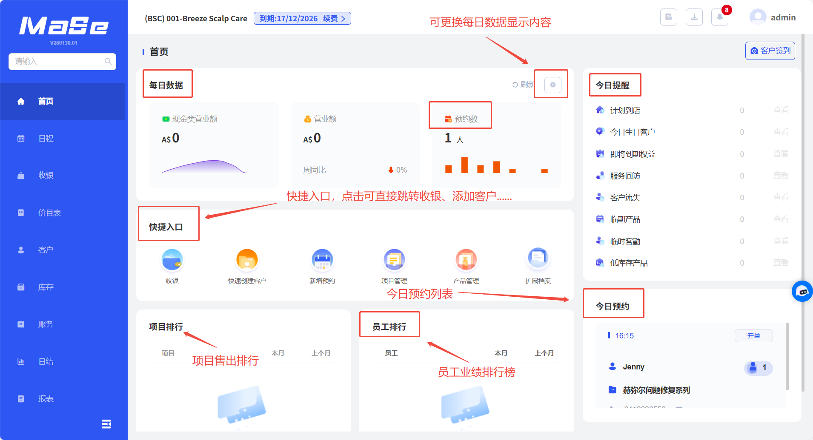

# 首页功能

  <strong>核心说明：</strong>
  在首页可查看每日数据，如营业额、今日预约人数等。

## 功能说明

  

    首页功能用于展示门店关键经营数据，并支持快速进入各业务操作模块。
  

  <ul className="key-list compact-list">
    <li>在首页可查看每日数据，如营业额、今日预约人数等</li>
    <li>首页有快捷键可以快速跳转收银、预约、新增客户界面</li>
    <li>首页可以查看项目售出排行、员工服务排行等</li>
  </ul>

  

    <strong>操作路径：</strong> 系统后台 → 首页
  

## 图片说明

  
  
图 1：首页界面

