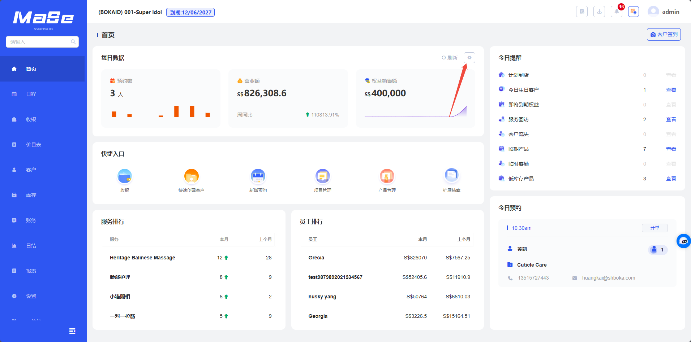

# 每日数据

  <strong>核心说明：</strong>
  首页上每日数据可以展示门店关键经营指标，包括营业额、预约数、客户增长等数据。

## 功能说明

  

    每日数据模块用于展示门店每日的核心经营数据，帮助快速掌握经营情况。
  

  <ul className="key-list compact-list">
    <li><strong>现金类营业额</strong>：统计所有已选现金类支付方式的总额</li>
    <li><strong>营业额</strong>：统计所有已选支付方式的总额</li>
    <li><strong>预约数</strong>：当天预约数</li>
    <li><strong>卡付类营业额</strong>：统计所有已选权益类支付方式的总额</li>
    <li><strong>权益销售额</strong>：通过权益售卖所获得的金额</li>
    <li><strong>权益销售数</strong>：已售权益数</li>
    <li><strong>新增顾客数</strong>：顾客列表中新增的顾客数</li>
    <li><strong>到店数</strong>：到店顾客数</li>
  </ul>

  

    <strong>操作路径：</strong> 系统后台 → 首页 → 每日数据
  

  

    可点击右上角齿轮按钮，选择需显示的数据，并设置显示排序，目前支持显示3类数据
  

## 图片说明

  

    每日数据模块用于展示门店每日的核心经营数据。
  

  

  
图 1：每日数据展示

