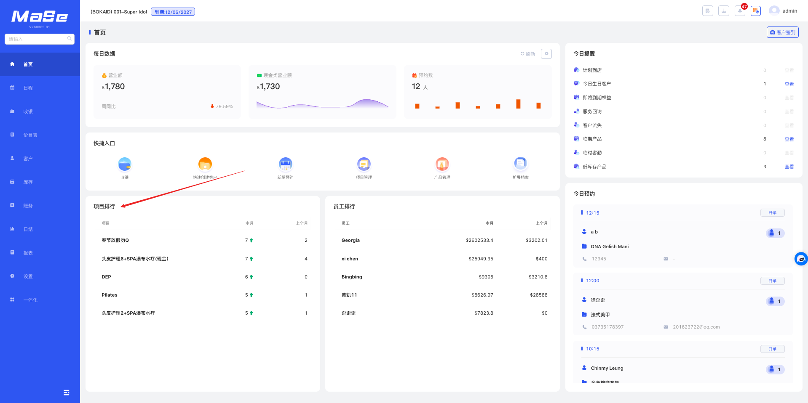

# 项目排行

  <strong>核心说明：</strong>
  服务排行展示的是本月项目的销售次数排行，从高到底排。

## 功能说明

  

    项目排行模块用于展示本月各项目的销售次数排行情况。
  

  <ul className="key-list compact-list">
    <li>服务排行展示的是本月项目的销售次数排行，从高到底排。</li>
  </ul>

  

    <strong>操作路径：</strong> 系统后台 → 首页 → 项目排行
  

## 图片说明

  

    项目排行模块用于展示本月各项目的销售次数排行情况。
  

  

  
图 1：项目排行展示

