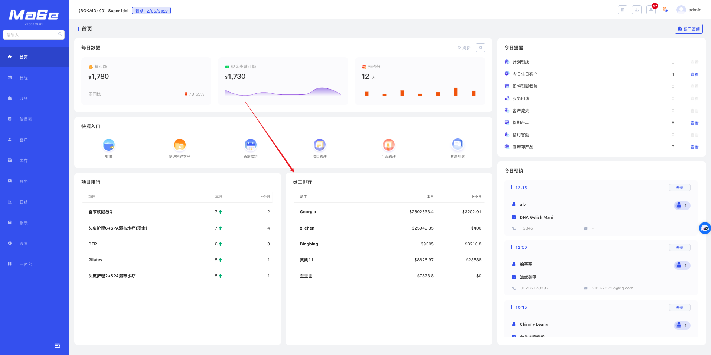

# 员工排行

  <strong>核心说明：</strong>
  首页员工排行用于展示员工为门店带来的营业额排行情况。

## 功能说明

  

    员工排行模块用于统计本月员工为门店带来的营业额，并进行从高到低排序展示。
  

  <ul className="key-list compact-list">
    <li>首页员工排行一栏的排序规则，是按照本月员工给门店带来的营业额，从高到低排序</li>
    <li>记录员工给门店带来的营业额，需要在收银界面选择对应的服务/销售员工</li>
  </ul>

  

    <strong>操作路径：</strong> 系统后台 → 首页 → 员工排行
  

## 图片说明

  

    员工排行模块用于展示员工营业额排名情况。
  

  

  
图 1：员工排行展示

