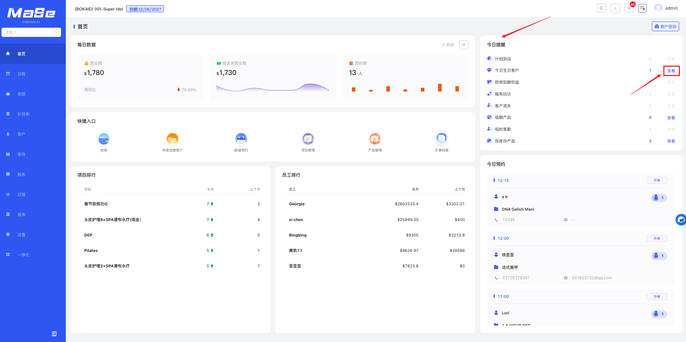

# 今日提醒

  <strong>核心说明：</strong>
  今日提醒用于展示门店关键运营提醒数据，帮助合理安排当日工作。

## 功能说明

  

    今日提醒模块用于集中展示门店各类重要提醒数据，并支持快速查看明细。
  

  <ul className="key-list compact-list">
    <li><strong>计划到店</strong>：代表项目设置中的“消费间隔”产生的客勤任务数量</li>
    <li><strong>今日生日客户</strong>：代表今日生日的会员人数</li>
    <li><strong>即将到期权益</strong>：代表门店即将过期的权益卡数量</li>
    <li><strong>服务回访</strong>：代表项目消费后生成的客勤任务数量</li>
    <li><strong>客户流失</strong>：代表系统生成的客户流失客勤任务数量（具体规则可在 <strong>设置 - 参数设置 - 客勤</strong> 中设置）</li>
    <li><strong>临期产品</strong>：代表保质期到期的产品数量（按 <strong>产品管理</strong> 中设置的保质期天数计算；如开启批次管理，则按有效期计算）</li>
    <li><strong>临时客勤</strong>：代表手动创建或系统触发的临时客户跟进任务数量</li>
    <li><strong>低库存产品</strong>：代表库存低于安全库存阈值的产品数量（根据 <strong>产品管理</strong> 中库存警戒单位计算）</li>
  </ul>

  

    可点击对应字段后的 <strong>“查看”</strong> 按钮查看相应的明细
  

  

    <strong>操作路径：</strong> 系统后台 → 首页 → 今日提醒
  

## 操作视频

  <iframe
    width="100%"
    height="500"
    src="https://www.youtube.com/embed/ZB8H6z7bVAc"
    title="YouTube video player"
    frameBorder="0"
    allow="accelerometer; autoplay; clipboard-write; encrypted-media; gyroscope; picture-in-picture; web-share; fullscreen"
    allowFullScreen
    referrerPolicy="strict-origin-when-cross-origin"
    style={{ border: 0, borderRadius: '12px'}}
  />

  如视频无法播放（例如无痕模式或未登录 Google），请点击下方按钮前往 YouTube 登录观看。

<a
  href="https://www.youtube.com/watch?v=ZB8H6z7bVAc"
  target="_blank"
  rel="noopener noreferrer"
  style={{
    display: 'inline-block',
    marginTop: '8px',
    padding: '10px 16px',
    background: '#2e8555',
    color: '#fff',
    borderRadius: '8px',
    textDecoration: 'none',
    fontWeight: 'bold',
  }}
>
  👉 打开 YouTube 观看（支持登录 / 全屏）
</a>

---

## 图片说明

  

    今日提醒模块用于展示门店各类运营提醒数据，并支持快速查看明细。
  

  

  
图 1：今日提醒展示

