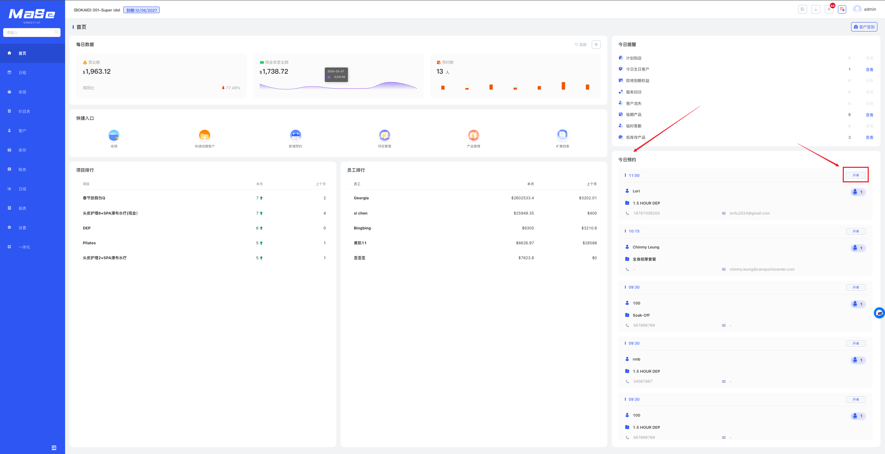

# 今日预约
## 功能说明

首页里的今日预约一栏，展示今日还没有开单的预约，顺序根据临近时间排序。 

---

## 功能入口

进入路径：

**系统后台** → **首页** → **今日预约** 
可点击相应预约后的“**开单**”按钮跳转去收银页面完成收款 

---

## 操作视频

  <iframe
    width="100%"
    height="500"
    src="https://www.youtube.com/embed/YSM6KCSAW-8"
    title="YouTube video player"
    frameBorder="0"
    allow="accelerometer; autoplay; clipboard-write; encrypted-media; gyroscope; picture-in-picture; web-share; fullscreen"
    allowFullScreen
    referrerPolicy="strict-origin-when-cross-origin"
    style={{ border: 0, borderRadius: '12px'}}
  />

  如视频无法播放（例如无痕模式或未登录 Google），请点击下方按钮前往 YouTube 登录观看。

<a
  href="https://www.youtube.com/watch?v=YSM6KCSAW-8"
  target="_blank"
  rel="noopener noreferrer"
  style={{
    display: 'inline-block',
    marginTop: '8px',
    padding: '10px 16px',
    background: '#2e8555',
    color: '#fff',
    borderRadius: '8px',
    textDecoration: 'none',
    fontWeight: 'bold',
  }}
>
  👉 打开 YouTube 观看（支持登录 / 全屏）
</a>

---

## 图片说明

---