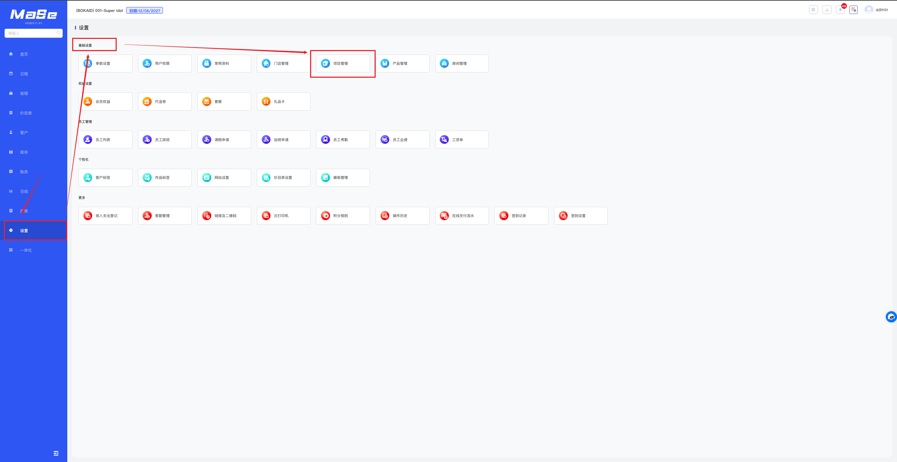
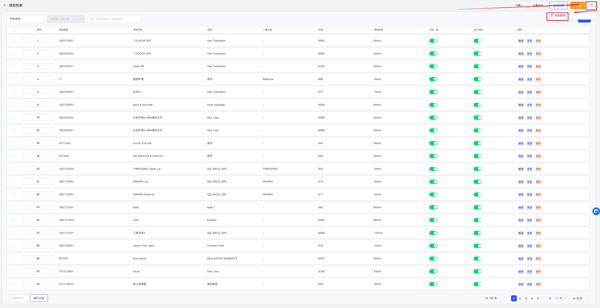
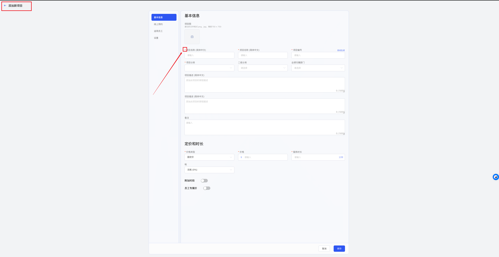
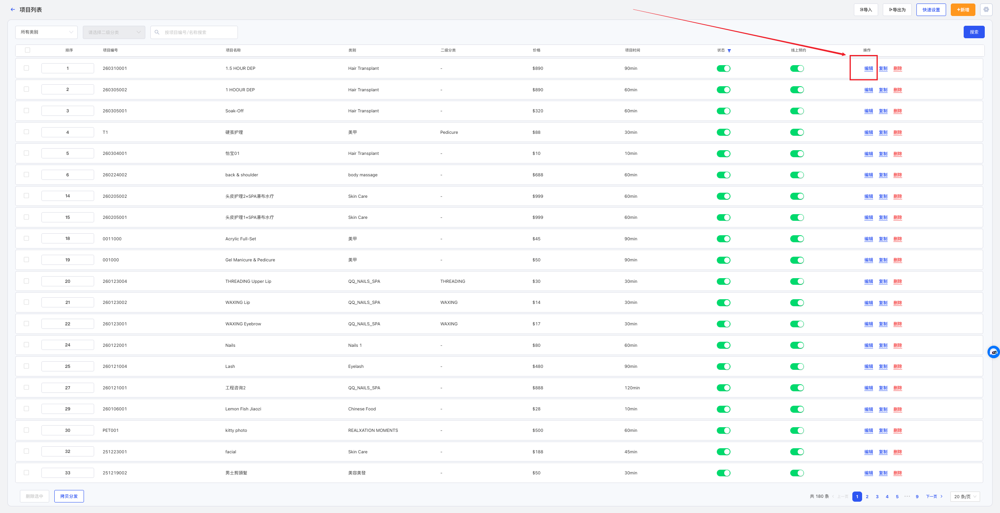
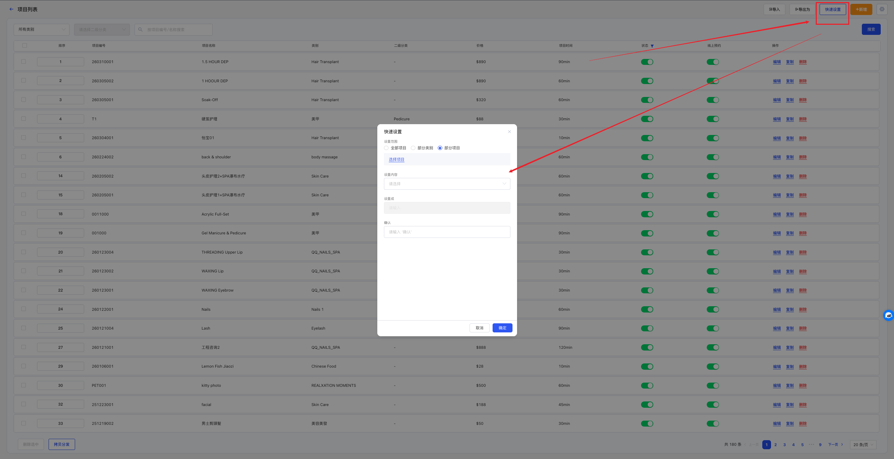
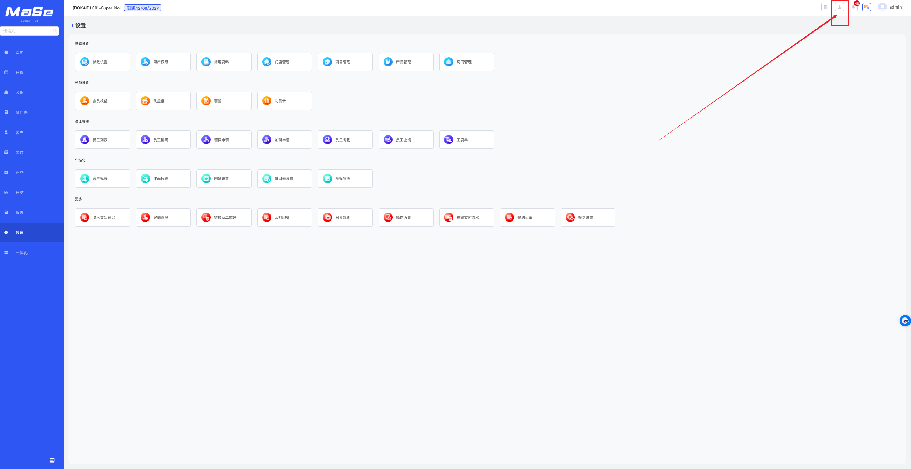
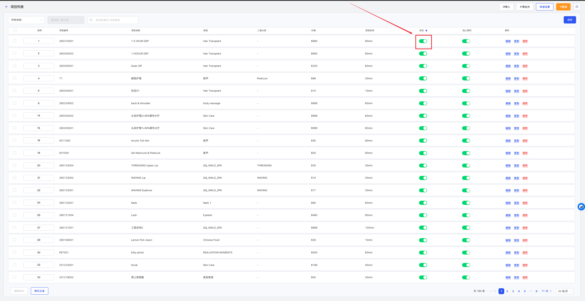
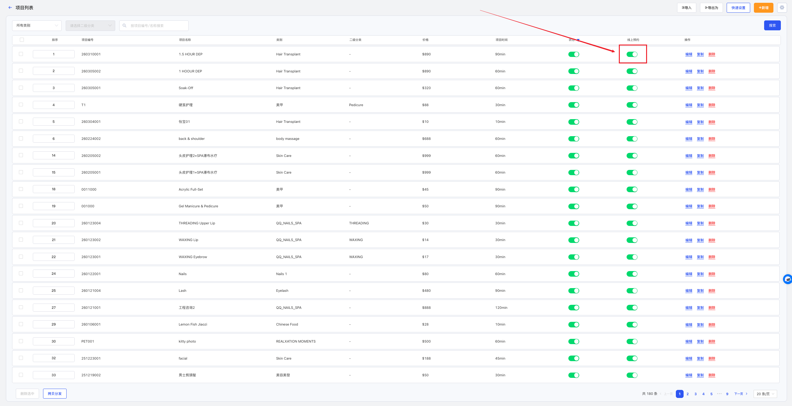
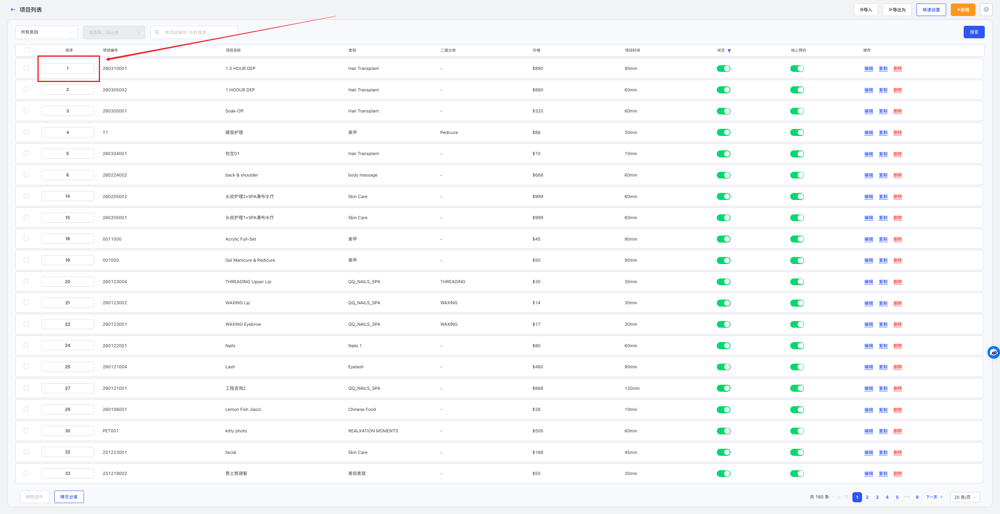

# 项目资料管理

<!-- ====================== 核心说明 ====================== -->

  <strong>核心说明：</strong>
  项目资料用于管理门店的服务项目信息，包括项目名称、价格、分类及积分规则等内容，是门店进行收银、预约及会员管理的重要基础数据。

<!-- ====================== 功能说明 ====================== -->
## 功能说明

<ul className="mobile-list">
  <li>
    <strong>项目管理：</strong>支持新增、编辑和维护门店服务项目。
  </li>
  <li>
    <strong>价格设置：</strong>可设置不同价格类型及对应收费标准。
  </li>
  <li>
    <strong>分类管理：</strong>支持自定义项目分类，便于统一管理与筛选。
  </li>
  <li>
    <strong>积分规则：</strong>可设置项目消费后获得积分。
  </li>
</ul>

<!-- ====================== 项目说明 ====================== -->
### 项目说明

  <ul className="key-list compact-list">
    <li>
      <strong>灵活配置：</strong>支持设置项目名称、编号、分类及价格类型等信息。
    </li>
    <li>
      <strong>批量操作：</strong>支持快速设置与批量修改项目内容。
    </li>
    <li>
      <strong>统一管理：</strong>所有项目集中管理，影响收银、预约等业务展示。
    </li>
  </ul>

<!-- ====================== 操作路径 ====================== -->

  <strong>操作路径：</strong> 设置 → 基础设置 → 项目管理

---

<!-- ====================== 操作视频 ====================== -->
## 操作视频

  

    <iframe
      src="https://www.youtube.com/embed/JjjpvZBnEHY"
      title="YouTube video player"
      frameBorder="0"
      allow="accelerometer; autoplay; clipboard-write; encrypted-media; gyroscope; picture-in-picture; web-share; fullscreen"
      allowFullScreen
      referrerPolicy="strict-origin-when-cross-origin"
    />
  

  

    

      如视频无法播放，请点击下方按钮前往 YouTube 登录观看。
    

    <a
      className="video-btn"
      href="https://www.youtube.com/watch?v=JjjpvZBnEHY"
      target="_blank"
      rel="noopener noreferrer"
    >
      👉 打开 YouTube 观看
    </a>
  

---

<!-- ====================== 操作步骤 ====================== -->
## 操作步骤

### 1. 添加服务

  

    进入 <strong>设置 → 基础设置 → 项目管理</strong> 页面。
  

  
  
图 1：项目列表

  

    点击右上角 <strong>⚙️ 类别管理</strong>，新增或关闭类别。
  

  
  
图 2：类别管理

  

    点击 <strong>新增</strong>，填写项目名称、编号、分类及价格类型等信息后保存。
  

  
  
图 3：新增项目

### 2. 编辑服务

  

    在项目列表中点击 <strong>编辑</strong>，修改内容后保存。
  

  
  
图 4：编辑项目

### 3. 快速设置服务

  

    点击 <strong>快速设置</strong>，选择范围与内容后批量修改。
  

  
  
图 5：快速设置

### 4. 导出服务

  

    点击 <strong>导出为</strong> 按钮导出数据。
  

  
  
图 6：导出数据

  

    在系统右上角下载导出的文件。
  

  
  
图 7：下载文件

### 5. 停用服务

  

    点击项目后的 <strong>状态</strong> 按钮关闭，该项目将不再显示，但不影响已售内容。
  

  
  
图 8：停用项目

### 6. 关闭在线预约

  

    点击 <strong>线上预约</strong> 按钮关闭，该项目将无法被预约。
  

  
  
图 9：关闭预约

### 7. 修改服务顺序

  

    修改排序数字，数字越小排序越靠前，影响收银及预约展示顺序。
  

  
  
图 10：排序设置

---

<!-- ====================== 温馨提示 ====================== -->
## 温馨提示

  <strong>注意 1：</strong> 系统中已使用的项目资料不允许删除。

  <strong>注意 2：</strong> 项目名称支持设置多种语言显示，可以在 <strong>设置 → 门店管理 → 门店资料 → 启用第二语言</strong> 中开启。

  <strong>注意 3：</strong> 项目类别需先在 <strong>项目列表 → 类别管理</strong> 中建立后，再进入项目资料中进行选择。

