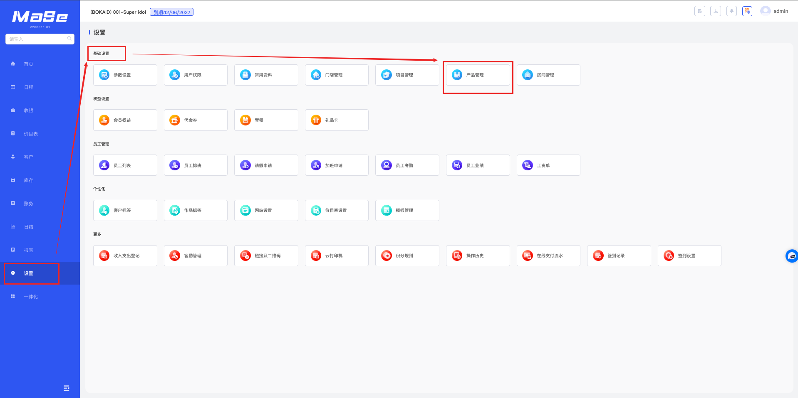
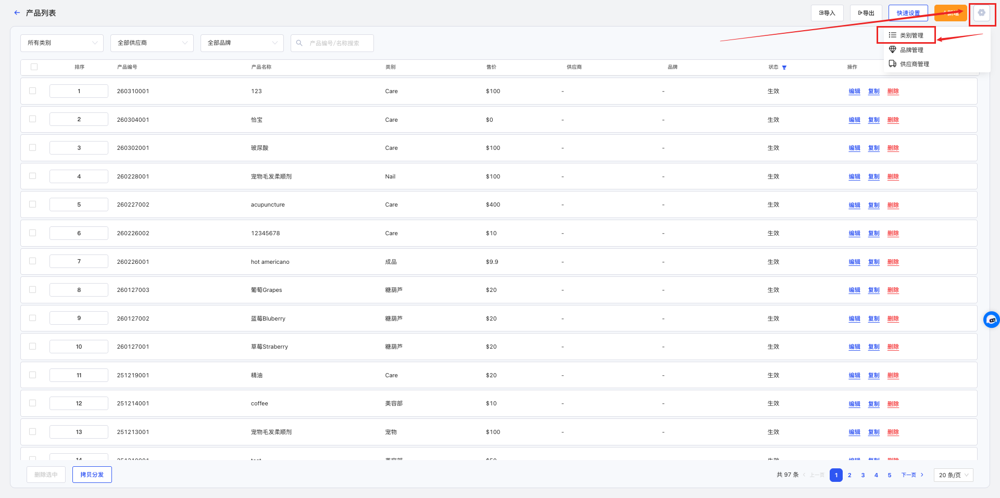
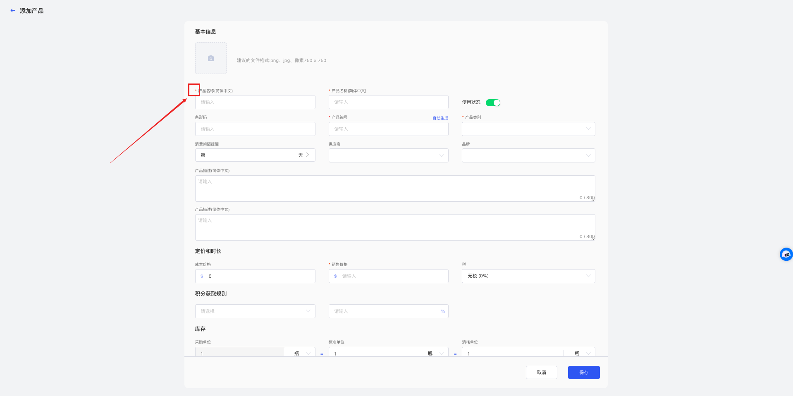
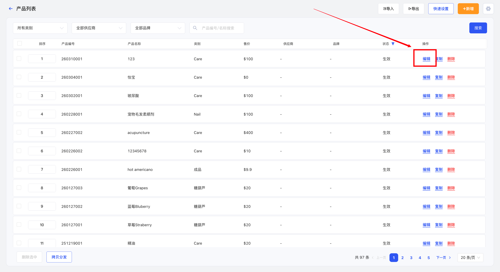
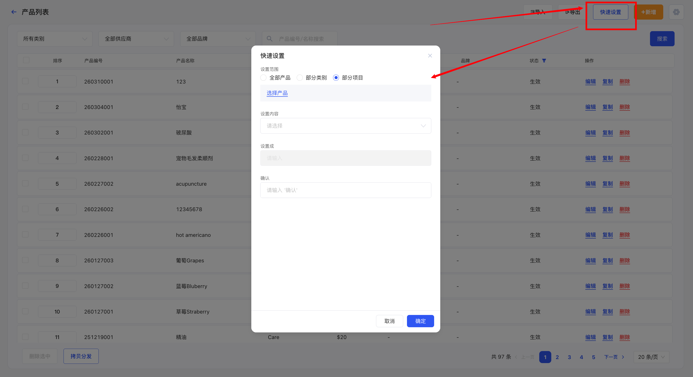
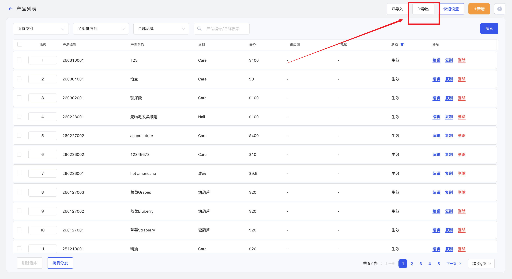
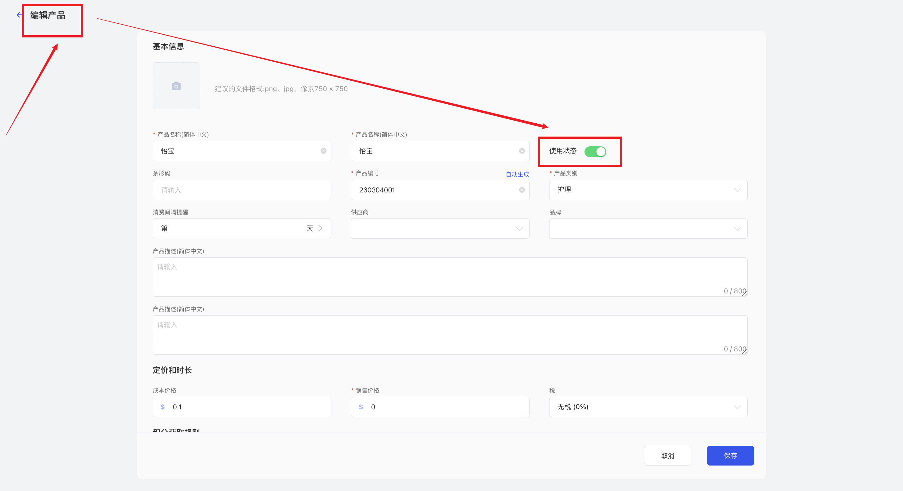
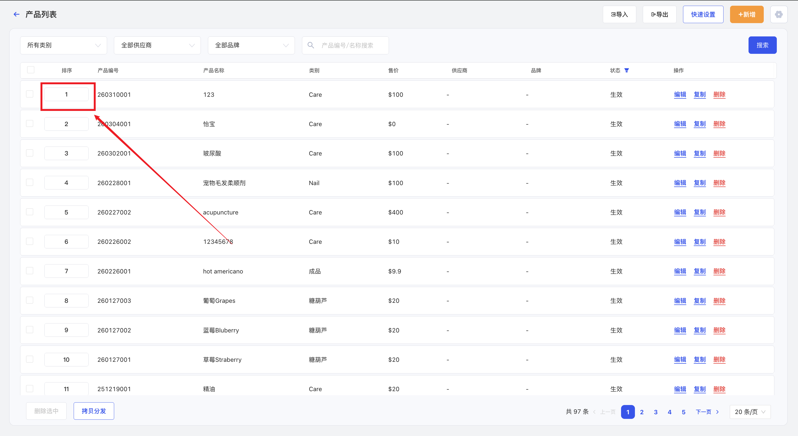

# 产品资料管理

<!-- ====================== 核心说明 ====================== -->

  <strong>核心说明：</strong>
  产品资料用于维护门店日常销售或使用的产品信息，包括产品名称、类别、价格及库存相关内容，是门店收银与库存管理的重要基础数据。

<!-- ====================== 功能说明 ====================== -->
## 功能说明

<ul className="mobile-list">
  <li>
    <strong>产品管理：</strong>支持新增、编辑和维护门店产品信息。
  </li>
  <li>
    <strong>价格设置：</strong>可设置产品销售价格及相关属性。
  </li>
  <li>
    <strong>分类管理：</strong>支持产品类别、品牌及供应商分类管理。
  </li>
  <li>
    <strong>统一维护：</strong>所有产品资料集中管理，影响收银及库存操作。
  </li>
</ul>

<!-- ====================== 产品说明 ====================== -->
### 产品说明

  <ul className="key-list compact-list">
    <li>
      <strong>灵活配置：</strong>支持设置产品名称、编号、类别及价格等信息。
    </li>
    <li>
      <strong>批量操作：</strong>支持快速设置与批量修改产品内容。
    </li>
    <li>
      <strong>统一管理：</strong>所有产品集中管理，影响门店销售与库存流程。
    </li>
  </ul>

<!-- ====================== 操作路径 ====================== -->

  <strong>操作路径：</strong> 设置 → 基础设置 → 产品管理

---

<!-- ====================== 操作步骤 ====================== -->
## 操作步骤

### 1. 添加产品

  

    进入 <strong>设置 → 基础设置 → 产品管理</strong> 页面。
  

  
  
图 1：产品列表

  

    点击右上角 <strong>⚙️ 类别管理</strong>，新增或关闭类别。
  

  
  
图 2：类别管理

  

    点击 <strong>新增</strong>，填写产品名称、编号、类别及销售价格等信息后保存。
  

  
  
图 3：新增产品

### 2. 编辑产品

  

    在产品列表中点击 <strong>编辑</strong>，修改内容后保存。
  

  
  
图 4：编辑产品

### 3. 快速设置产品

  

    点击 <strong>快速设置</strong>，选择范围与内容后批量修改。
  

  
  
图 5：快速设置

### 4. 导出产品

  

    点击 <strong>导出为</strong> 按钮导出数据。
  

  
  
图 6：导出数据

  

    在系统右上角下载导出的文件。
  

  
  
图 7：下载文件

### 5. 停用产品

  

    点击产品后的 <strong>编辑</strong>，进入详情页面关闭 <strong>使用状态</strong> 并保存。
  

  
  
图 8：进入编辑

  
  
图 9：停用产品

### 6. 修改产品顺序

  

    修改排序数字，数字越小排序越靠前，影响收银及库存展示顺序。
  

  
  
图 10：排序设置

---

<!-- ====================== 温馨提示 ====================== -->
## 温馨提示

  <strong>注意 1：</strong> 系统中已使用的产品资料不允许删除。

  <strong>注意 2：</strong> 产品名称支持设置多种语言显示，可以在 <strong>设置 → 门店管理 → 门店资料 → 启用第二语言</strong> 中开启。

  <strong>注意 3：</strong> 产品类别、品牌、供应商需先在 <strong>产品列表 → 类别管理 / 品牌管理 / 供应商管理</strong> 中建立后，再进入产品资料中进行选择。

