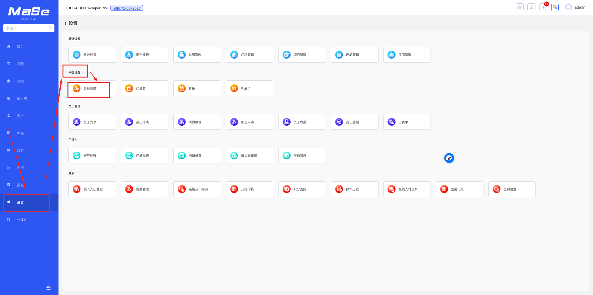
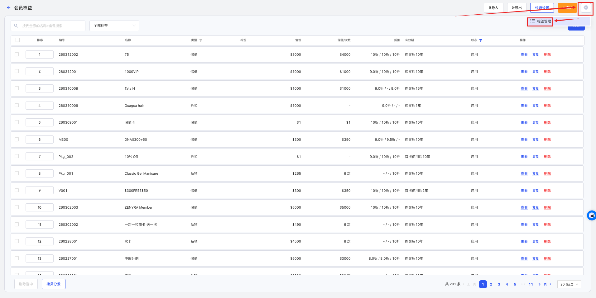
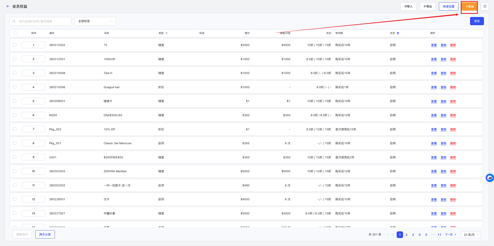
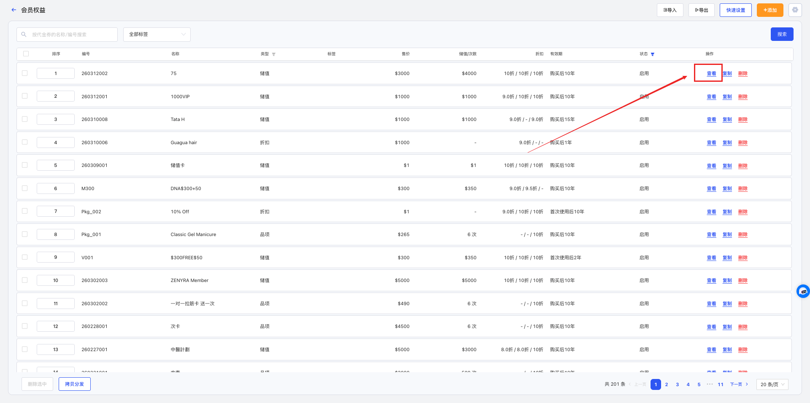
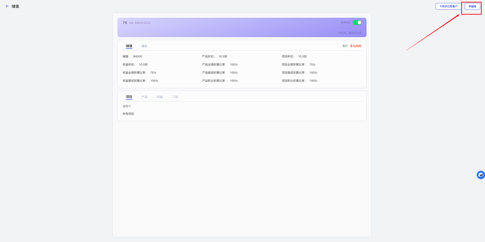
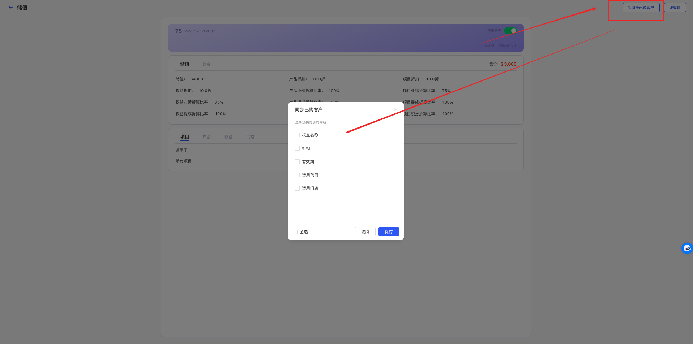
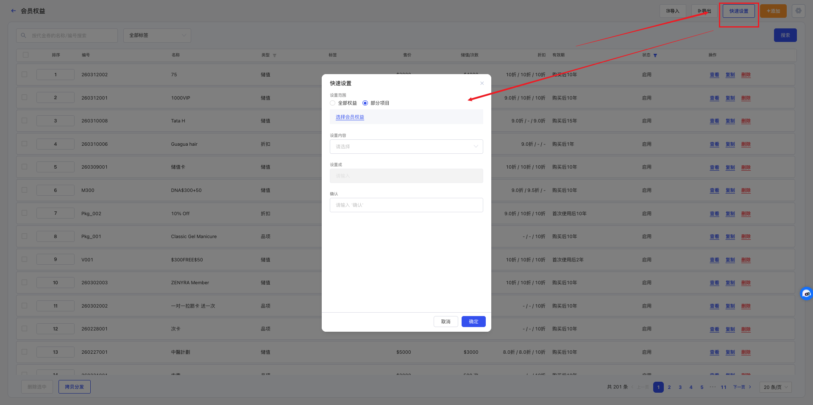
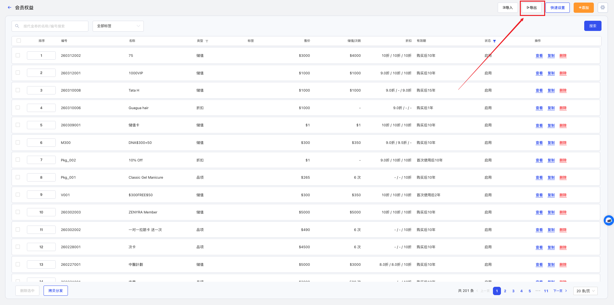

# 会员权益管理

<!-- ====================== 核心说明 ====================== -->

  <strong>核心说明：</strong>
  会员权益用于设置顾客充值会员卡后的消费规则与优惠方式，包括有效期限、售价、储值金额及折扣等内容，帮助门店灵活管理会员体系。

<!-- ====================== 功能说明 ====================== -->
## 功能说明

<ul className="mobile-list">
  <li>
    <strong>会员管理工具：</strong>用于配置不同类型会员卡的消费规则与优惠方式。
  </li>
  <li>
    <strong>灵活营销：</strong>支持通过储值、折扣或次数形式提升客户复购与粘性。
  </li>
  <li>
    <strong>统一管理：</strong>所有会员权益集中管理，影响收银及会员消费流程。
  </li>
</ul>

<!-- ====================== 会员权益分类说明 ====================== -->
### 会员权益分类说明

  <ul className="key-list compact-list">
    <li>
      <strong>储值卡：</strong>
      客户预存金额到账户，消费时按余额扣减，可设置赠金、有效期及适用范围。
    </li>
    <li>
      <strong>折扣卡：</strong>
      客户消费时享受固定折扣（如 8 折），不涉及金额储值。
    </li>
    <li>
      <strong>次卡（品项卡）：</strong>
      客户获得固定次数服务，每次消费扣减次数。
    </li>
  </ul>

<!-- ====================== 操作路径 ====================== -->

  <strong>操作路径：</strong> 设置 → 权益设置 → 会员权益

---

<!-- ====================== 操作视频 ====================== -->
## 操作视频

  

    <iframe
      src="https://www.youtube.com/embed/jndhJLOq-sY"
      title="YouTube video player"
      frameBorder="0"
      allow="accelerometer; autoplay; clipboard-write; encrypted-media; gyroscope; picture-in-picture; web-share; fullscreen"
      allowFullScreen
      referrerPolicy="strict-origin-when-cross-origin"
    />
  

  

    

      如视频无法播放，请点击下方按钮前往 YouTube 登录观看。
    

    <a
      className="video-btn"
      href="https://www.youtube.com/watch?v=jndhJLOq-sY"
      target="_blank"
      rel="noopener noreferrer"
    >
      👉 打开 YouTube 观看
    </a>
  

---

<!-- ====================== 操作步骤 ====================== -->
## 操作步骤

### 1. 添加会员权益

  

    进入 <strong>设置 → 权益设置 → 会员权益</strong> 页面。
  

  
  
图 1：会员权益列表

  

    点击右上角 <strong>⚙️ 标签管理</strong>，新增或关闭标签。
  

  
  
图 2：标签管理

  

    点击 <strong>添加</strong>，填写编号、名称、类型及销售价格等信息后保存。
  

  
  
图 3：新增会员权益

### 2. 编辑会员权益

  

    点击权益后的 <strong>查看</strong>，再点击 <strong>编辑</strong> 进行修改。
  

  
  
图 4：查看权益

  
  
图 5：编辑权益

### 3. 同步已购客户

  

    修改不会自动影响已售权益，如需同步，可使用同步功能。
  

  
  
图 6：进入详情

  

    点击 <strong>同步已购客户</strong>，选择同步内容后保存。
  

  
  
图 7：同步设置

### 4. 快速设置会员权益

  

    点击 <strong>快速设置</strong>，选择范围与内容后批量修改。
  

  
  
图 8：快速设置

### 5. 导出会员权益

  

    点击 <strong>导出</strong> 按钮导出数据。
  

  
  
图 9：导出数据

  

    在系统右上角下载文件。
  

  
  
图 10：下载文件

### 6. 停用会员权益

  

    在详情中关闭 <strong>使用状态</strong>，该权益将不再可用，但不影响已售权益继续使用。
  

  
  
图 11：进入详情

  
  
图 12：停用权益

---

<!-- ====================== 温馨提示 ====================== -->
## 温馨提示

  <strong>注意 1：</strong> 系统中已使用的会员权益不允许删除。

  <strong>注意 2：</strong> 会员权益中的项目折扣及产品折扣需要输入 0 - 10 之间的数字，例如 7.5 表示七五折。

  <strong>注意 3：</strong> 储值权益为顾客先储值后消费，折扣权益为顾客购买后消费时享受折扣，品项权益为顾客购买后按次数消费。

