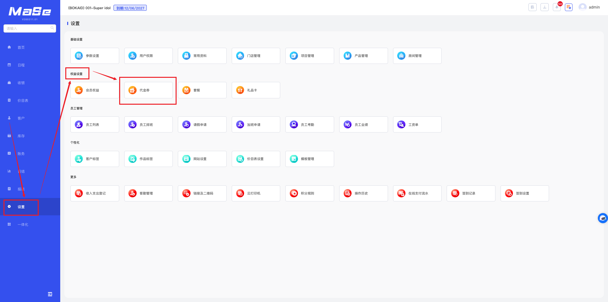
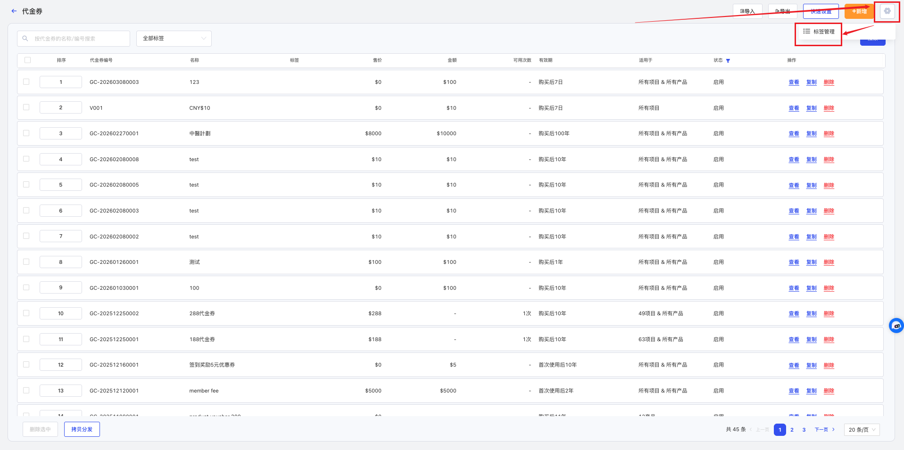
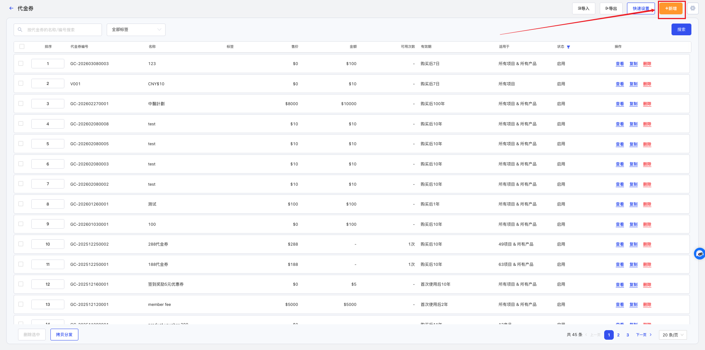
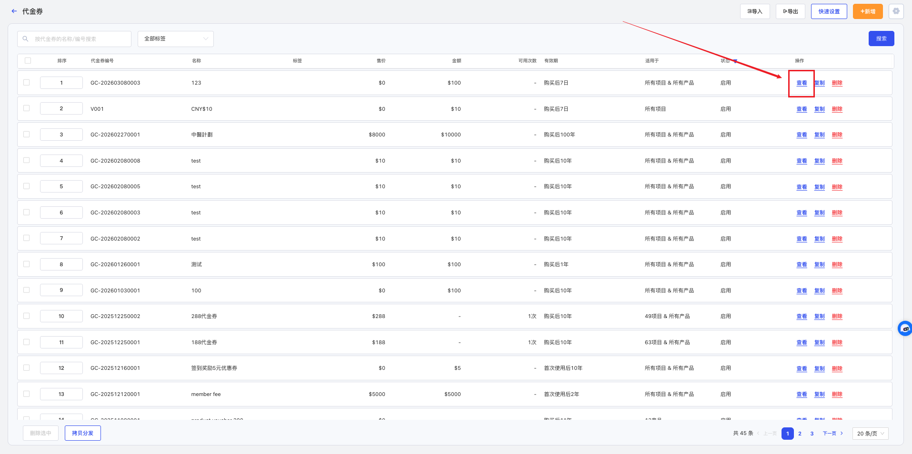
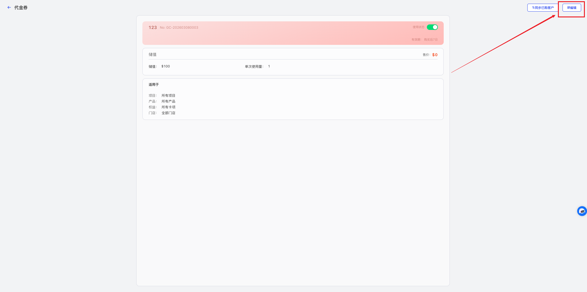
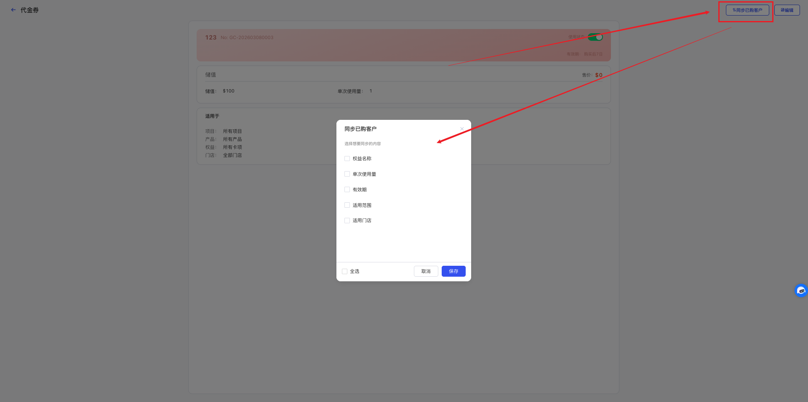
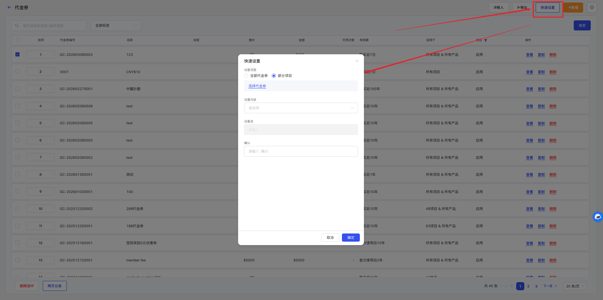
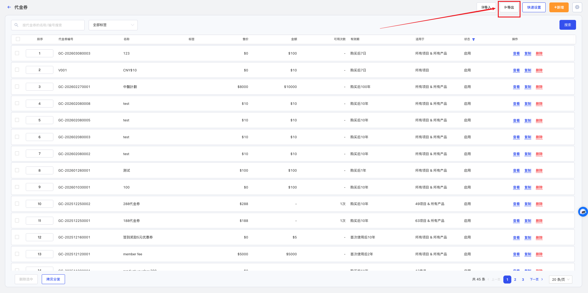
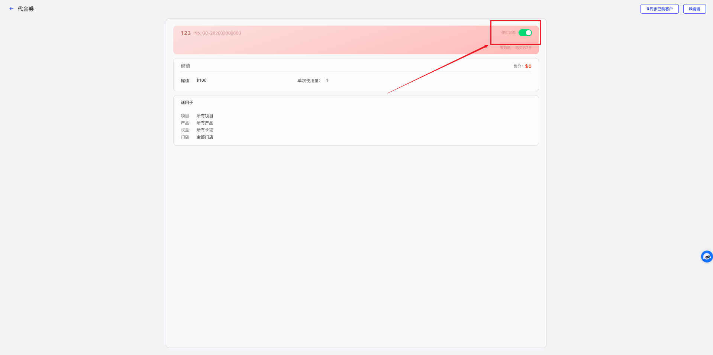

# 代金券管理

<!-- ====================== 核心说明 ====================== -->

  <strong>核心说明：</strong>
  代金券用于门店设置优惠促销活动，可通过金额或次数形式为顾客提供消费抵扣，支持赠送或销售使用。

<!-- ====================== 功能说明 ====================== -->
## 功能说明

<ul className="mobile-list">
  <li>
    <strong>营销工具：</strong>用于门店开展优惠活动，提升客户转化与复购。
  </li>
  <li>
    <strong>灵活发放：</strong>支持免费赠送或销售给顾客使用。
  </li>
  <li>
    <strong>消费抵扣：</strong>顾客到店消费时可使用代金券进行金额或次数抵扣。
  </li>
</ul>

<!-- ====================== 代金券分类说明 ====================== -->
### 代金券分类说明

  <ul className="key-list compact-list">
    <li>
      <strong>储值代金券：</strong>
      提供固定金额抵扣（如 50 元），消费时按金额扣减，仅可使用一次，即使有剩余金额也无法再次使用。
    </li>
    <li>
      <strong>次数代金券：</strong>
      提供指定项目的使用次数，每次消费自动扣减一次，适用于指定服务。
    </li>
  </ul>

<!-- ====================== 操作路径 ====================== -->

  <strong>操作路径：</strong> 设置 → 权益设置 → 代金券

---

<!-- ====================== 操作视频 ====================== -->
## 操作视频

  

    <iframe
      src="https://www.youtube.com/embed/NTWdGMAXLaU"
      title="YouTube video player"
      frameBorder="0"
      allow="accelerometer; autoplay; clipboard-write; encrypted-media; gyroscope; picture-in-picture; web-share; fullscreen"
      allowFullScreen
      referrerPolicy="strict-origin-when-cross-origin"
    />
  

  

    

      如视频无法播放，请点击下方按钮前往 YouTube 登录观看。
    

    <a
      className="video-btn"
      href="https://www.youtube.com/watch?v=NTWdGMAXLaU"
      target="_blank"
      rel="noopener noreferrer"
    >
      👉 打开 YouTube 观看
    </a>
  

---

<!-- ====================== 操作步骤 ====================== -->
## 操作步骤

### 1. 添加代金券

  

    进入 <strong>设置 → 权益设置 → 代金券</strong> 页面。
  

  
  
图 1：代金券列表

  

    点击右上角 <strong>⚙️ 标签管理</strong>，新增或关闭标签。
  

  
  
图 2：标签管理

  

    点击 <strong>新增</strong>，填写代金券编号、名称、类型及销售价格等信息后保存。
  

  
  
图 3：新增代金券

### 2. 编辑代金券

  

    点击代金券后的 <strong>查看</strong>，再点击 <strong>编辑</strong> 进行修改。
  

  
  
图 4：查看代金券

  
  
图 5：编辑代金券

### 3. 同步已购客户

  

    修改代金券不会自动影响已售代金券，如需同步，可使用同步功能。
  

  
  
图 6：进入详情

  

    点击 <strong>同步已购客户</strong>，选择同步内容后保存。
  

  
  
图 7：同步设置

### 4. 快速设置代金券

  

    点击 <strong>快速设置</strong>，选择范围与内容后批量修改。
  

  
  
图 8：快速设置

### 5. 导出代金券

  

    点击 <strong>导出</strong> 按钮导出数据。
  

  
  
图 9：导出数据

  

    在系统右上角下载文件。
  

  
  
图 10：下载文件

### 6. 停用代金券

  

    在代金券详情中关闭 <strong>使用状态</strong>，该代金券将不再可用，但不影响已售代金券继续使用。
  

  
  
图 11：进入详情

  
  
图 12：停用代金券

---

<!-- ====================== 温馨提示 ====================== -->
## 温馨提示

  <strong>注意 1：</strong> 系统中已经使用的代金券不允许删除。

  <strong>注意 2：</strong> 储值代金券只能使用一次，即使消费后有剩余金额，也无法再次使用。

  <strong>注意 3：</strong> 次数代金券仅适用于指定项目，每次消费后会自动扣减对应次数。

  <strong>注意 4：</strong> 停用代金券后，不会影响已经售出的代金券继续消费。

