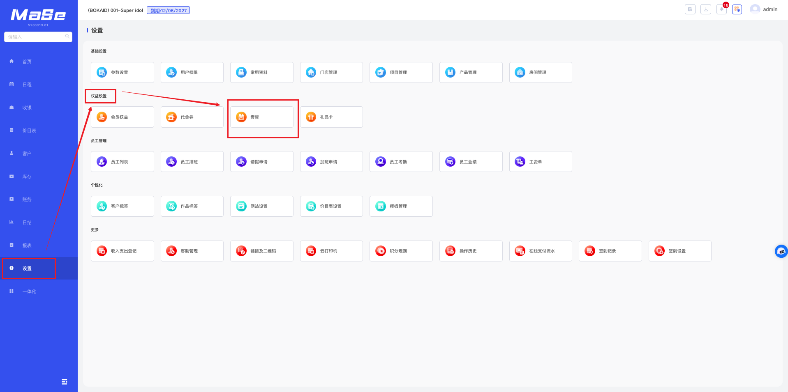
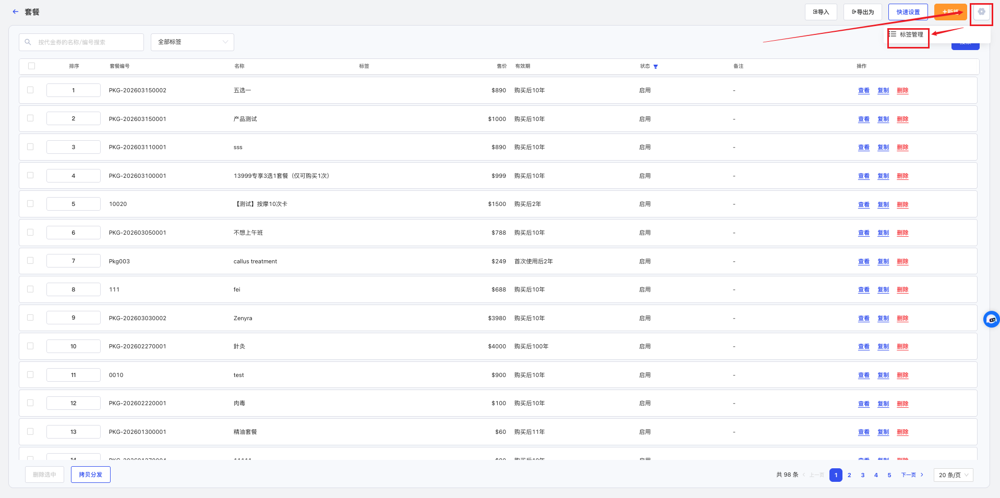
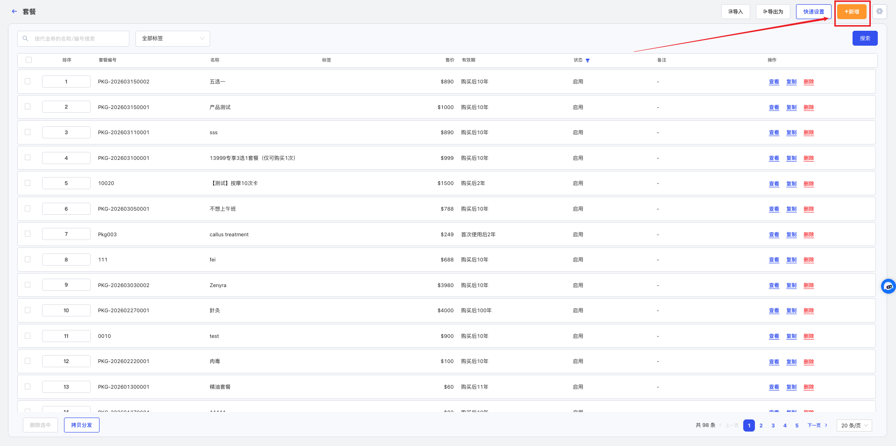
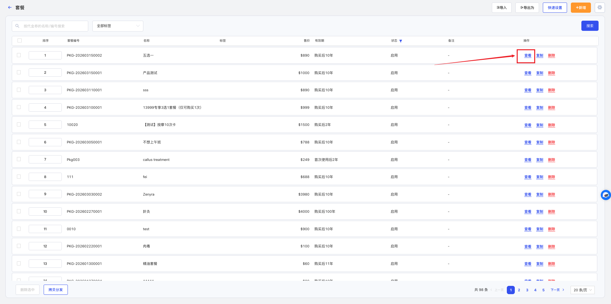
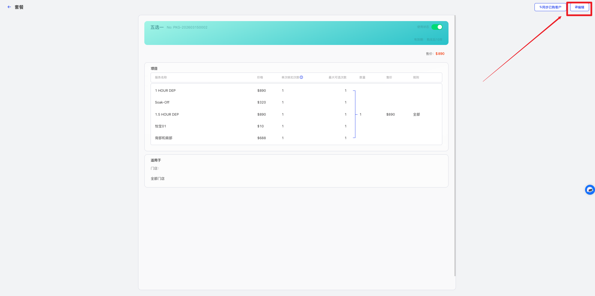
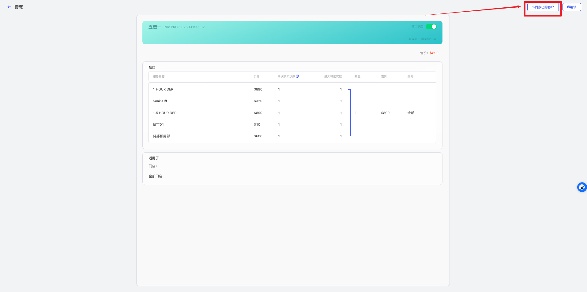
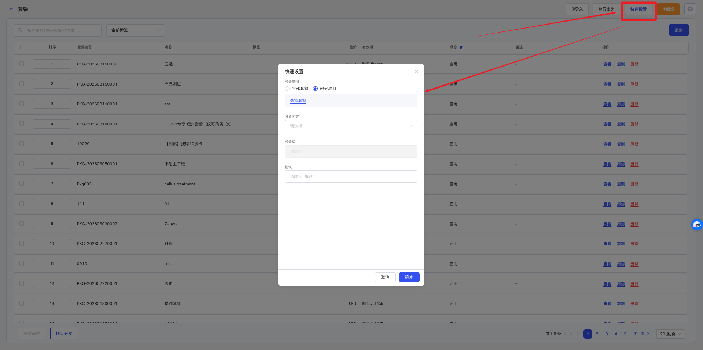
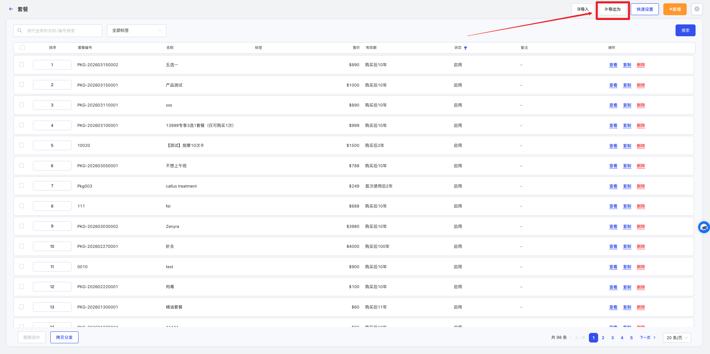
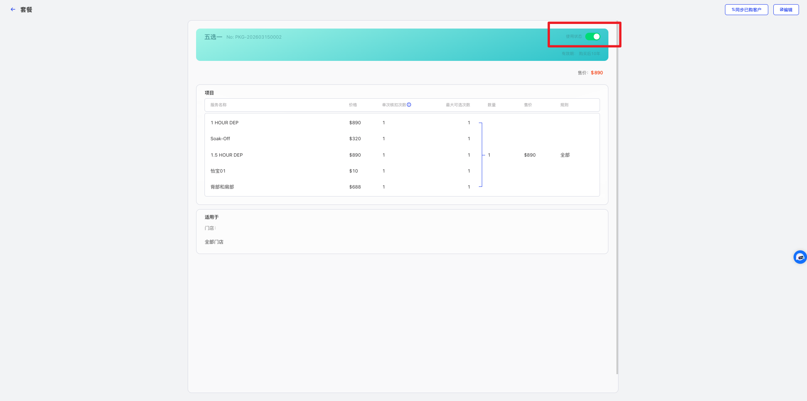

# 套餐管理

<!-- ====================== 核心说明 ====================== -->

  <strong>核心说明：</strong>
  套餐用于将多个项目或产品进行组合销售，以统一价格打包出售，帮助门店提升客单价并优化销售结构。

<!-- ====================== 功能说明 ====================== -->
## 功能说明

<ul className="mobile-list">
  <li>
    <strong>组合销售：</strong>支持将多个项目或产品打包为一个套餐统一销售。
  </li>
  <li>
    <strong>提升转化：</strong>通过优惠组合价格提升客户购买意愿与客单价。
  </li>
  <li>
    <strong>灵活配置：</strong>支持设置套餐有效期、使用规则及内容组合方式。
  </li>
</ul>

<!-- ====================== 套餐组合说明 ====================== -->
### 套餐组合说明

  <ul className="key-list compact-list">
    <li>
      <strong>单项：</strong>套餐中包含固定的项目或产品，客户购买后按设定内容逐项消费。
    </li>
    <li>
      <strong>组合：</strong>套餐中提供多个项目或产品供客户选择，支持“多选一”等灵活组合方式。
    </li>
  </ul>

<!-- ====================== 操作路径 ====================== -->

  <strong>操作路径：</strong> 设置 → 权益设置 → 套餐

---

<!-- ====================== 操作视频 ====================== -->
## 操作视频

  

    <iframe
      src="https://www.youtube.com/embed/mVMh5HU41oA"
      title="YouTube video player"
      frameBorder="0"
      allow="accelerometer; autoplay; clipboard-write; encrypted-media; gyroscope; picture-in-picture; web-share; fullscreen"
      allowFullScreen
      referrerPolicy="strict-origin-when-cross-origin"
    />
  

  

    

      如视频无法播放，请点击下方按钮前往 YouTube 登录观看。
    

    <a
      className="video-btn"
      href="https://www.youtube.com/watch?v=mVMh5HU41oA"
      target="_blank"
      rel="noopener noreferrer"
    >
      👉 打开 YouTube 观看
    </a>
  

---

<!-- ====================== 操作步骤 ====================== -->
## 操作步骤

### 1. 添加套餐

  

    进入 <strong>设置 → 权益设置 → 套餐</strong> 页面。
  

  
  
图 1：套餐列表

  

    点击右上角 <strong>⚙️ 标签管理</strong>，新增或管理标签。
  

  
  
图 2：标签管理

  

    点击 <strong>新增</strong>，填写套餐编号、套餐名称、有效类型、分配规则等内容后保存。
  

  
  
图 3：新增套餐

### 2. 编辑套餐

  

    点击套餐后的 <strong>查看</strong>，再点击 <strong>编辑</strong> 进行修改。
  

  
  
图 4：查看套餐

  
  
图 5：编辑套餐

### 3. 同步已购客户

  

    修改不会自动影响已售套餐，如需同步，可使用 <strong>同步已购客户</strong> 功能。
  

  
  
图 6：进入详情

  

    点击右上角 <strong>同步已购客户</strong>，选择需要同步的内容后保存。
  

  
  
图 7：同步设置

### 4. 快速设置套餐

  

    点击 <strong>快速设置</strong>，选择设置范围及内容后，可批量修改套餐资料。
  

  
  
图 8：快速设置

### 5. 导出套餐

  

    点击右上角 <strong>导出为</strong> 按钮，可将套餐资料导出为表格。
  

  
  
图 9：导出套餐

  

    导出完成后，可在系统右上角下载导出的文件。
  

  
  
图 10：下载文件

### 6. 停用套餐

  

    在套餐详情中关闭 <strong>使用状态</strong>，该套餐将不再可用，但不影响已售套餐继续使用。
  

  
  
图 11：进入详情

  
  
图 12：停用套餐

---

<!-- ====================== 温馨提示 ====================== -->
## 温馨提示

  <strong>注意 1：</strong> 系统中已经使用的套餐<strong>不允许删除</strong>。

  <strong>注意 2：</strong> 套餐销售价格是套餐明细中的项目销售价和产品销售价的<strong>合计价格</strong>。

  <strong>注意 3：</strong> 套餐明细添加时的单项是指独立的项目或者产品，组合是指可以将项目或产品采用<strong>多选一</strong>的模式进行组合。

