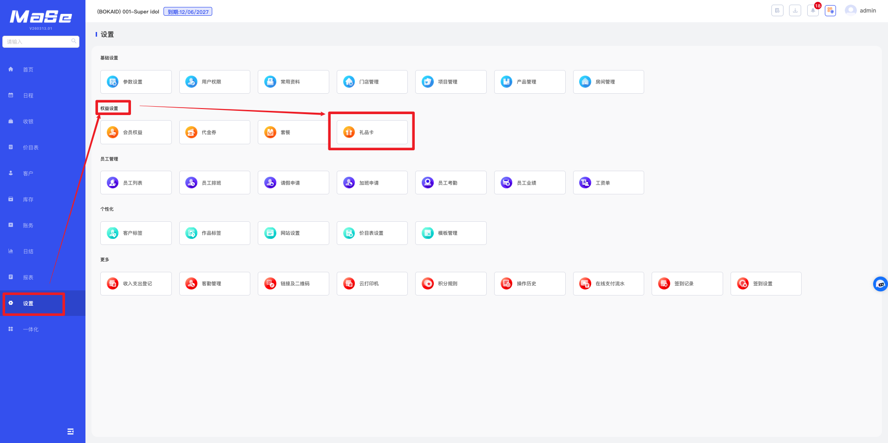
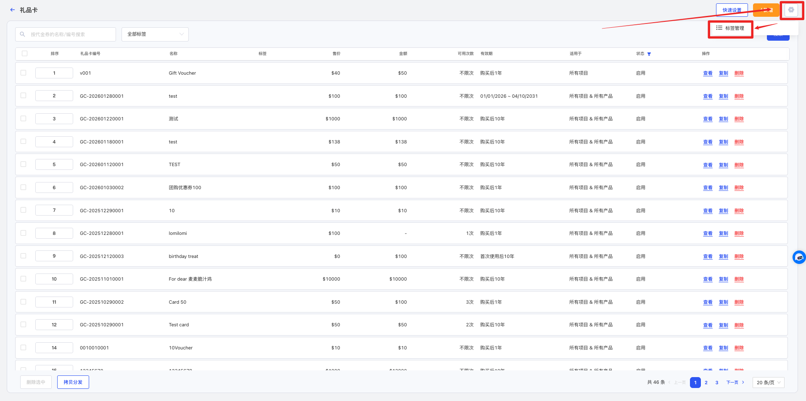
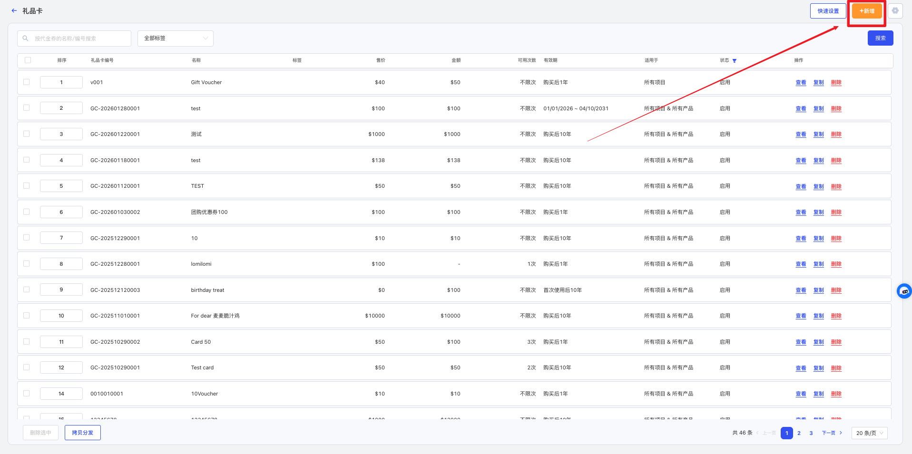
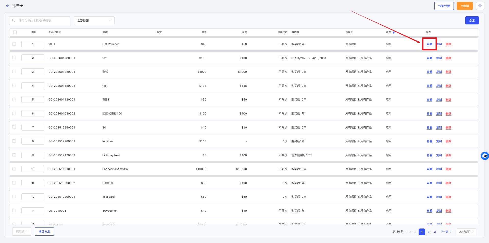
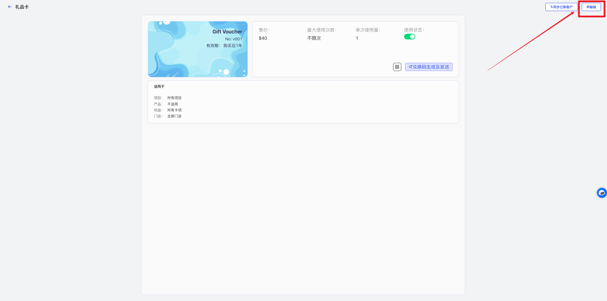
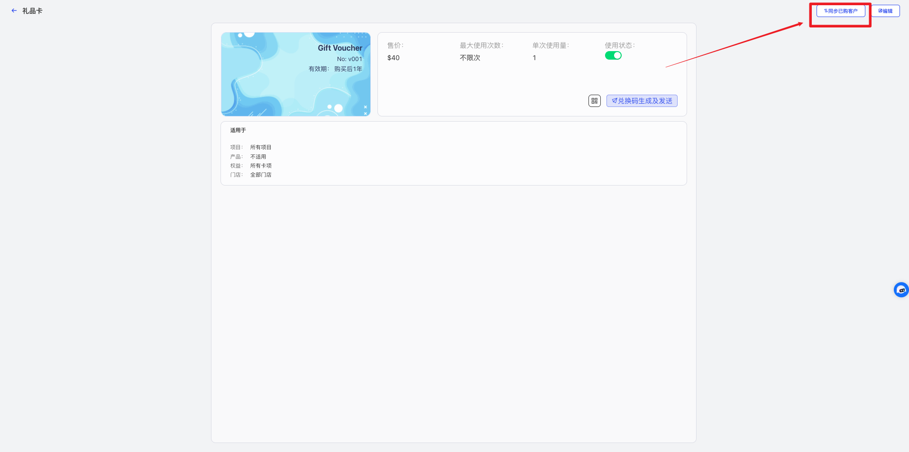
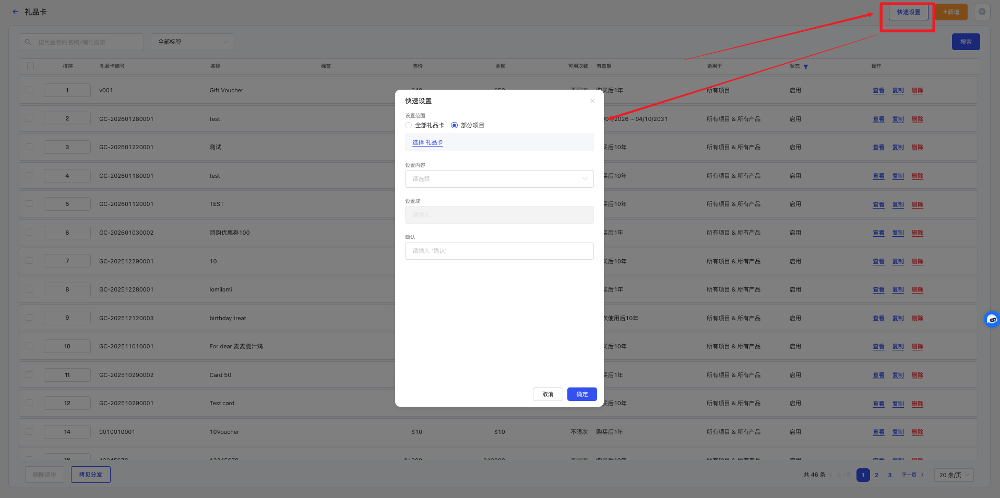
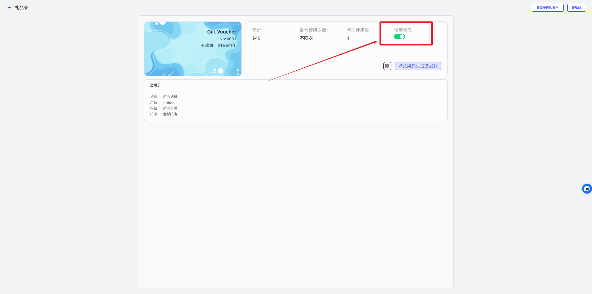

# 礼品卡管理

<!-- ====================== 核心说明 ====================== -->

  <strong>核心说明：</strong>
  礼品卡用于门店促销及客户赠送，可通过金额或次数形式为顾客提供消费抵扣。

<!-- ====================== 功能说明 ====================== -->
## 功能说明

<ul className="mobile-list">
  <li>
    <strong>优惠工具：</strong>支持通过礼品卡进行金额或次数抵扣。
  </li>
  <li>
    <strong>发放方式：</strong>可用于销售或免费赠送给顾客。
  </li>
  <li>
    <strong>灵活使用：</strong>支持设置有效期及适用范围。
  </li>
</ul>

<!-- ====================== 礼品卡类型说明 ====================== -->
### 礼品卡类型说明

  <ul className="key-list compact-list">
    <li>
      <strong>金额礼品卡（储值型）：</strong>
      设置面值和售价，客户消费时可按实际金额抵扣，支持多次使用，直到余额用完。
    </li>
    <li>
      <strong>次数礼品卡（次卡型）：</strong>
      提供指定次数使用机会，每次消费扣减 1 次。
    </li>
  </ul>

<!-- ====================== 操作路径 ====================== -->

  <strong>操作路径：</strong> 设置 → 权益设置 → 礼品卡

---

<!-- ====================== 操作视频 ====================== -->
## 操作视频

  

    <iframe
      src="https://www.youtube.com/embed/1CtIqS8O-ec"
      title="YouTube video player"
      frameBorder="0"
      allow="accelerometer; autoplay; clipboard-write; encrypted-media; gyroscope; picture-in-picture; web-share; fullscreen"
      allowFullScreen
      referrerPolicy="strict-origin-when-cross-origin"
    />
  

  

    

      如视频无法播放，请点击下方按钮前往 YouTube 登录观看。
    

    <a
      className="video-btn"
      href="https://www.youtube.com/watch?v=1CtIqS8O-ec"
      target="_blank"
      rel="noopener noreferrer"
    >
      👉 打开 YouTube 观看
    </a>
  

---

<!-- ====================== 操作步骤 ====================== -->
## 操作步骤

### 1. 添加礼品卡

  

    进入 <strong>设置 → 权益设置 → 礼品卡</strong> 页面。
  

  
  
图 1：礼品卡列表

  

    点击右上角 <strong>⚙️ 类别管理</strong>，新增或管理类别。
  

  
  
图 2：类别管理

  

    点击 <strong>新增</strong>，填写礼品卡编号、名称、礼品卡类型、售价等信息后保存。
  

  
  
图 3：新增礼品卡

### 2. 编辑礼品卡

  

    点击礼品卡后的 <strong>查看</strong>，再点击 <strong>编辑</strong> 进行修改。
  

  
  
图 4：查看礼品卡

  
  
图 5：编辑礼品卡

### 3. 同步已购客户

  

    修改不会自动影响已售礼品卡，如需同步，可使用 <strong>同步已购客户</strong> 功能。
  

  
  
图 6：进入详情

  

    点击右上角 <strong>同步已购客户</strong>，选择要同步的内容后保存。
  

  
  
图 7：同步设置

### 4. 快速设置礼品卡

  

    点击 <strong>快速设置</strong>，选择设置范围及内容后，可批量修改礼品卡资料。
  

  
  
图 8：快速设置

### 5. 停用礼品卡

  

    在礼品卡详情中关闭 <strong>使用状态</strong>，该礼品卡将不再可用，但不影响已售礼品卡继续使用。
  

  
  
图 9：进入详情

  
  
图 10：停用礼品卡

---

<!-- ====================== 温馨提示 ====================== -->
## 温馨提示

  <strong>注意 1：</strong> 系统中已经使用的礼品卡不允许删除。

  <strong>注意 2：</strong> 金额礼品卡支持多次消费抵扣，直到余额用完为止。

  <strong>注意 3：</strong> 次数礼品卡会在每次消费后自动扣减 1 次。

  <strong>注意 4：</strong> 停用礼品卡后，不会影响已经售出的礼品卡继续消费。

