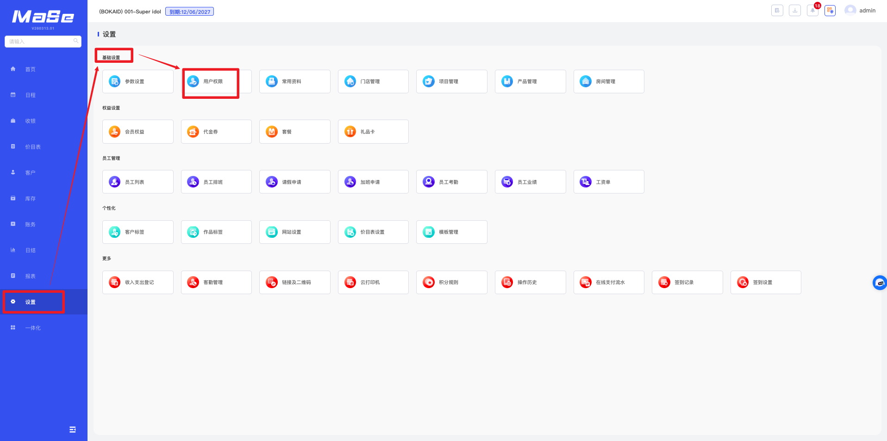
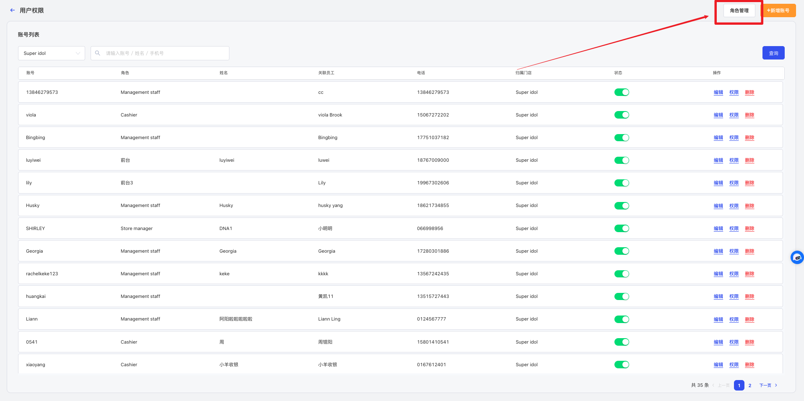
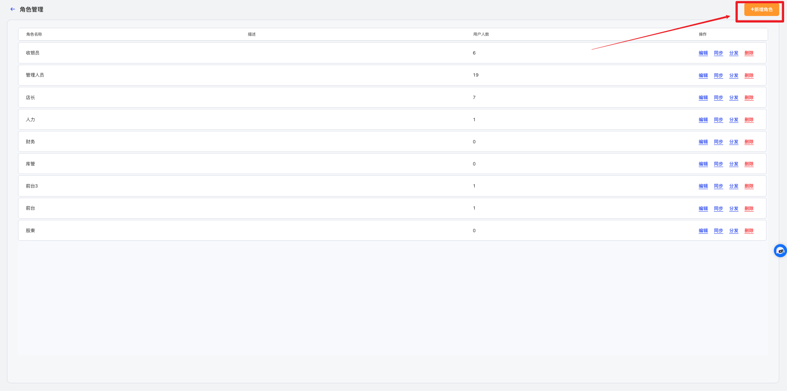
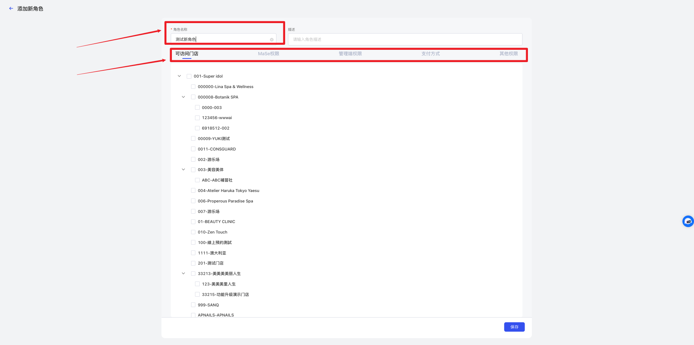
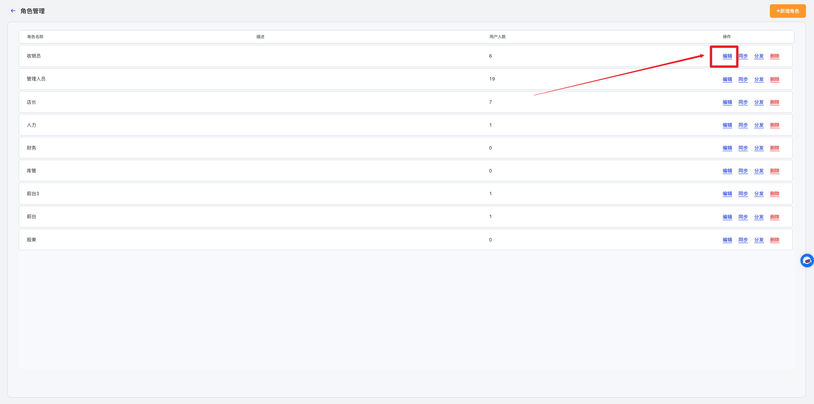
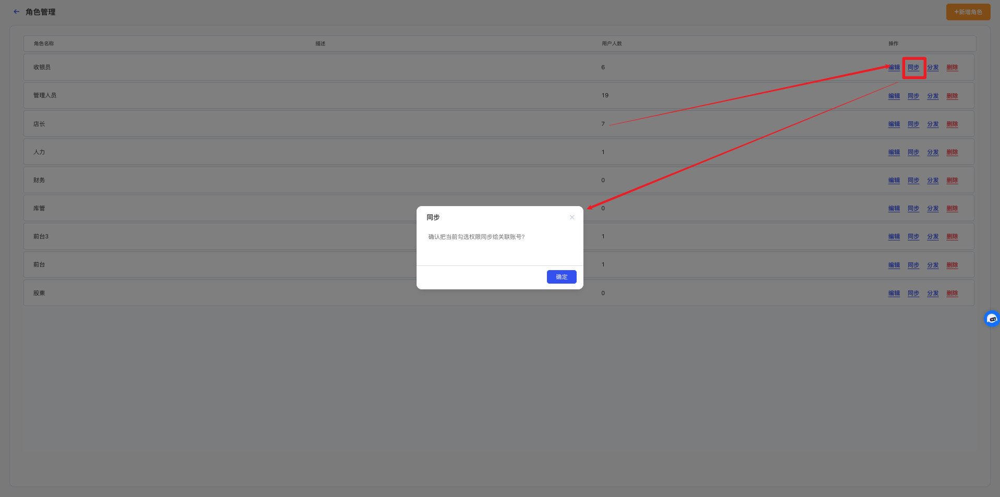

# 用户角色管理

<!-- ====================== 核心说明 ====================== -->

  <strong>核心说明：</strong>
  用户角色用于统一配置系统权限，通过预设角色实现账号权限的快速分配与管理。

<!-- ====================== 功能说明 ====================== -->
## 功能说明

<ul className="mobile-list">
  <li>
    <strong>权限控制：</strong>用于管理不同岗位在系统中的功能使用范围。
  </li>
  <li>
    <strong>快速配置：</strong>新增用户时可直接选择角色，快速完成权限分配。
  </li>
  <li>
    <strong>统一管理：</strong>集中控制系统菜单、数据及操作权限，提高管理效率与安全性。
  </li>
</ul>

<!-- ====================== 权限说明 ====================== -->
### 权限说明

  <ul className="key-list compact-list">
    <li>
      <strong>可访问门店：</strong>该角色可登录及使用的门店范围。
    </li>
    <li>
      <strong>MaSe权限：</strong>该角色可使用的系统菜单及功能权限。
    </li>
    <li>
      <strong>管理端权限：</strong>该角色可使用的 <strong>MaSe Center</strong> 手机 APP 功能权限。
    </li>
    <li>
      <strong>支付方式：</strong>该角色在收银时可使用的支付方式。
    </li>
    <li>
      <strong>其他权限：</strong>系统后台中的敏感数据及特殊功能控制权限。
    </li>
  </ul>

<!-- ====================== 操作路径 ====================== -->

  <strong>操作路径：</strong> 设置 → 基础设置 → 用户权限

---

<!-- ====================== 操作视频 ====================== -->
## 操作视频

  

    <iframe
      src="https://www.youtube.com/embed/NX_g41A2A-g"
      title="YouTube video player"
      frameBorder="0"
      allow="accelerometer; autoplay; clipboard-write; encrypted-media; gyroscope; picture-in-picture; web-share; fullscreen"
      allowFullScreen
      referrerPolicy="strict-origin-when-cross-origin"
    />
  

  

    

      如视频无法播放，请点击下方按钮前往 YouTube 登录观看。
    

    <a
      className="video-btn"
      href="https://www.youtube.com/watch?v=NX_g41A2A-g"
      target="_blank"
      rel="noopener noreferrer"
    >
      👉 打开 YouTube 观看
    </a>
  

---

<!-- ====================== 操作步骤 ====================== -->
## 操作步骤

<!-- ---------- 步骤 1：添加角色 ---------- -->
### 1. 添加角色

  

    在 “MaSe” 导航栏中打开 <strong>设置 → 基础设置 → 用户权限</strong>，进入 <strong>用户权限</strong> 页面。
  

  
  
图 1：用户权限页面

  

    在 <strong>用户权限</strong> 页面点击右上角 <strong>角色管理</strong>，进入 <strong>角色管理</strong> 页面。
  

  
  
图 2：角色管理页面

  

    点击右上角 <strong>新建角色</strong>，进入 <strong>添加新角色</strong> 页面。
  

  
  
图 3：添加新角色入口

  

    输入 <strong>角色名称</strong>，设置 <strong>可访问门店</strong>、<strong>MaSe权限</strong>、<strong>支付方式</strong>、<strong>特殊权限</strong>、<strong>管理端权限</strong> 等内容后点击 <strong>保存</strong>。
  

  
  
图 4：添加新角色

<!-- ---------- 步骤 2：编辑角色 ---------- -->
### 2. 编辑角色

  

    在 <strong>角色管理</strong> 页面，点击要修改的角色后的 <strong>编辑</strong> 按钮。
  

  
  
图 5：编辑角色

  

    修改相关内容后，点击 <strong>保存</strong> 完成设置。
  

<!-- ---------- 步骤 3：同步角色权限 ---------- -->
### 3. 同步角色权限

  

    修改 <strong>角色权限</strong> 后，修改的内容并不会自动同步给已经设置的账号中，防止已设置的用户权限资料混乱，影响门店角色权限管理。
  

  

    如果需要同步修改内容到 <strong>已有的用户权限</strong>，在 <strong>角色管理</strong> 页面点击要同步的角色后的 <strong>同步</strong> 按钮。
  

  
  
图 6：同步角色权限

  

    点击 <strong>确定</strong> 按钮后，已修改的内容便会同步到已有账户。
  

---

<!-- ====================== 温馨提示 ====================== -->
## 温馨提示

  <strong>注意：</strong> 角色删除：系统<strong>内置的</strong>用户角色只能修改不允许删除，门店<strong>自定义的</strong>用户角色可以修改及删除；

