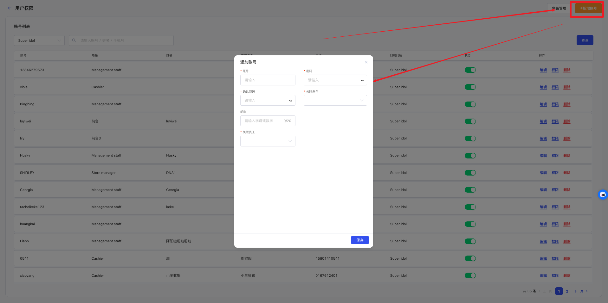
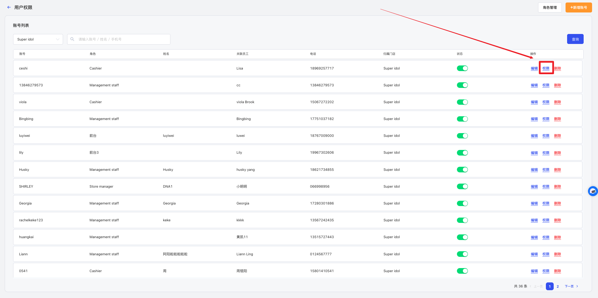
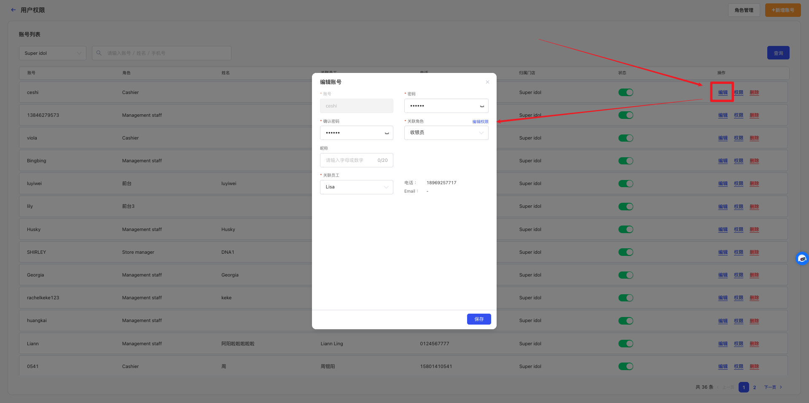
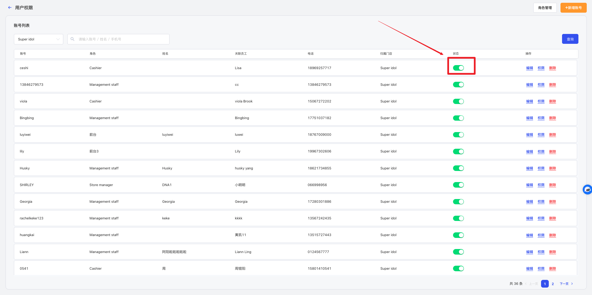

# 用户权限管理

<!-- ====================== 核心说明 ====================== -->

  <strong>核心说明：</strong>
  用户权限用于管理系统登录账号，通过绑定角色自动继承对应权限，实现快速权限分配。

<!-- ====================== 功能说明 ====================== -->
## 功能说明

<ul className="mobile-list">
  <li>
    <strong>账号管理：</strong>支持为不同员工创建独立登录账号。
  </li>
  <li>
    <strong>角色绑定：</strong>通过绑定角色自动获取权限配置。
  </li>
  <li>
    <strong>灵活调整：</strong>支持在账号层级进行权限细化调整。
  </li>
</ul>

<!-- ====================== 权限机制说明 ====================== -->
### 权限机制说明

  <ul className="key-list compact-list">
    <li>
      <strong>账号：</strong>系统登录主体，每个员工对应一个账号。
    </li>
    <li>
      <strong>角色：</strong>权限集合，账号通过绑定角色获取权限。
    </li>
    <li>
      <strong>权限来源：</strong>优先继承角色权限，也可针对账号单独调整权限。
    </li>
  </ul>

<!-- ====================== 操作路径 ====================== -->

  <strong>操作路径：</strong> 设置 → 基础设置 → 用户权限

---

<!-- ====================== 操作视频 ====================== -->
## 操作视频

  

    <iframe
      src="https://www.youtube.com/embed/dDXqYsLQ2xQ"
      title="YouTube video player"
      frameBorder="0"
      allow="accelerometer; autoplay; clipboard-write; encrypted-media; gyroscope; picture-in-picture; web-share; fullscreen"
      allowFullScreen
      referrerPolicy="strict-origin-when-cross-origin"
    />
  

  

    

      如视频无法播放，请点击下方按钮前往 YouTube 登录观看。
    

    <a
      className="video-btn"
      href="https://www.youtube.com/watch?v=dDXqYsLQ2xQ"
      target="_blank"
      rel="noopener noreferrer"
    >
      👉 打开 YouTube 观看
    </a>
  

---

<!-- ====================== 操作步骤 ====================== -->
## 操作步骤

### 1. 添加用户账号

  

    进入 <strong>设置 → 基础设置 → 用户权限</strong> 页面。
  

  
  
图 1：用户权限列表

  

    点击右上角 <strong>新增账号</strong>，进入创建页面。
  

  

    填写登录账号、密码、昵称，并选择角色及绑定员工后保存。
  

  
  
图 2：新增用户账号

### 2. 编辑账号权限

  

    点击账号后的 <strong>权限</strong> 按钮，可对权限进行单独调整。
  

  

    若账号已绑定角色，则默认继承角色权限，也可单独取消或开启某些权限。
  

  
  
图 3：编辑权限

### 3. 编辑账号信息

  

    点击账号后的 <strong>编辑</strong> 按钮，可修改账号基本信息。
  

  

    可修改登录密码、绑定角色、昵称、绑定员工等资料。
  

  
  
图 4：编辑账号

### 4. 停用用户账号

  

    在用户权限列表中关闭账号状态后，该账号将无法登录系统。
  

  

    停用账号不会删除历史数据，重新开启后可继续使用。
  

  
  
图 5：停用账号

<!-- ====================== 温馨提示 ====================== -->
## 温馨提示

  <strong>注意 1：</strong> 建议先配置好角色权限，再创建用户账号。

  <strong>注意 2：</strong> 员工离职后，其账号将自动失效，无法登录系统。

  <strong>注意 3：</strong> 如果账号已绑定角色，后续角色权限发生修改时，可通过同步功能更新账号权限。

