# 员工排班管理

<!-- ====================== 核心说明 ====================== -->

  <strong>核心说明：</strong>
  员工排班用于安排员工每日工作时间、班次及休息日，帮助门店统一管理员工出勤情况，并提升日常运营效率。

<!-- ====================== 功能说明 ====================== -->
## 功能说明

<ul className="mobile-list">
  <li><strong>班次安排：</strong>支持为员工设置每日班次、上班时间及休息时间。</li>
  <li><strong>排班管理：</strong>可按天、周或月查看员工排班情况，方便统一管理。</li>
  <li><strong>考勤关联：</strong>排班结果会影响员工考勤、工作时长及工资计算。</li>
</ul>

<!-- ====================== 系统字段说明 ====================== -->
### 系统字段说明

  <ul className="key-list compact-list">
    <li><strong>班次：</strong>员工当天的工作时间安排，例如早班、午班或晚班。</li>
    <li><strong>工作时长：</strong>根据排班时间自动计算员工当天工作总时长。</li>
    <li><strong>重复排班：</strong>支持将当前排班复制到后续日期，减少重复操作。</li>
  </ul>

<!-- ====================== 操作路径 ====================== -->

  <strong>操作路径：</strong> 设置 → 员工管理 → 员工排班

<!-- ====================== 操作视频 ====================== -->
{/*
## 操作视频

  

    <iframe
      src="https://www.youtube.com/embed/VSsU9MVqAEs"
      title="YouTube video player"
      frameBorder="0"
      allow="accelerometer; autoplay; clipboard-write; encrypted-media; gyroscope; picture-in-picture; web-share; fullscreen"
      allowFullScreen
      referrerPolicy="strict-origin-when-cross-origin"
    />
  

  

    

      如视频无法播放，请点击下方按钮前往 YouTube 登录观看。
    

    <a
      className="video-btn"
      href="https://www.youtube.com/watch?v=VSsU9MVqAEs"
      target="_blank"
      rel="noopener noreferrer"
    >
      👉 打开 YouTube 观看
    </a>
  

*/}

<!-- ====================== 操作步骤 ====================== -->
## 操作步骤

<!-- ---------- 步骤 1：新增排班班次 ---------- -->
### 1. 新增排班班次

  

    在 “MaSe” 导航栏中打开 <strong>设置 → 员工管理 → 员工管理</strong>，进入员工排班页面。
  

  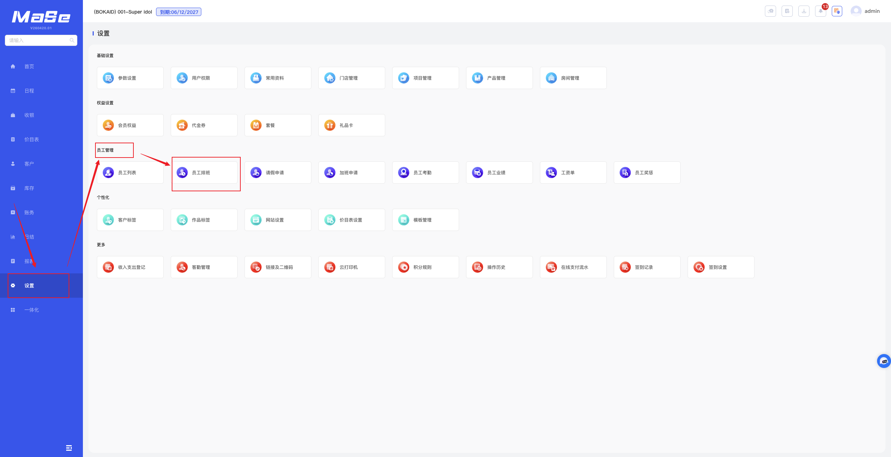
  
图 1：进入员工排班页面

  

    在 <strong>员工排班</strong> 页面，点击左上角 <strong>添加新班次</strong>，进入添加新班次页面。
  

  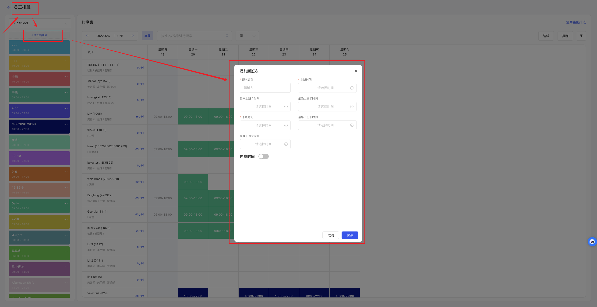
  
图 2：添加新班次

  

    在 <strong>添加新班次</strong> 页面，输入 <strong>班次名称，上班时间，下班时间</strong> 等必填选项后，点击 <strong>保存</strong>，即可创建新班次。
  

  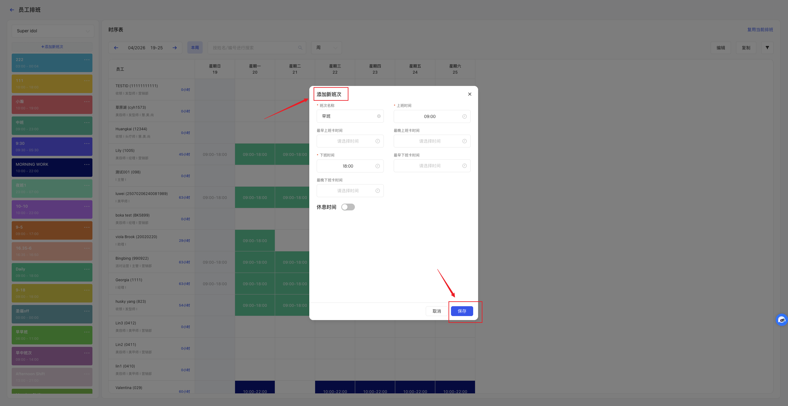
  
图 3：保存新班次

<!-- ---------- 步骤 2：修改班次设置 ---------- -->
### 2. 修改班次设置

  

    在 <strong>员工排班</strong> 页面，点击需要修改的班次右上角的 <strong>...</strong> 更多按钮，再点击 <strong>编辑</strong> 按钮进入编辑新班次页面。
    

  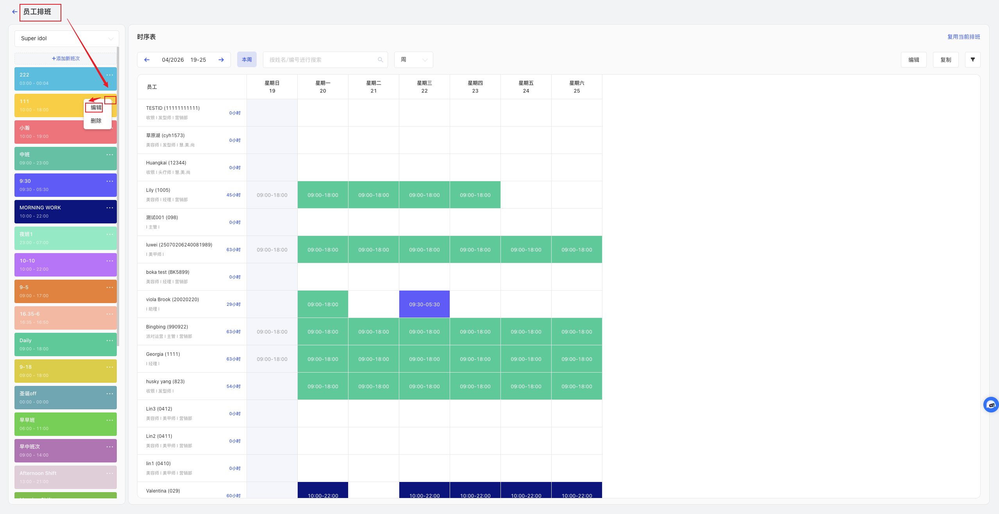
  
图 4：编辑新班次

  

    在 <strong>编辑新班次</strong> 页面，修改想要修改的字段，如班次名称，上班时间，下班时间等，点击 <strong>保存</strong> 按钮完成设置。
  

  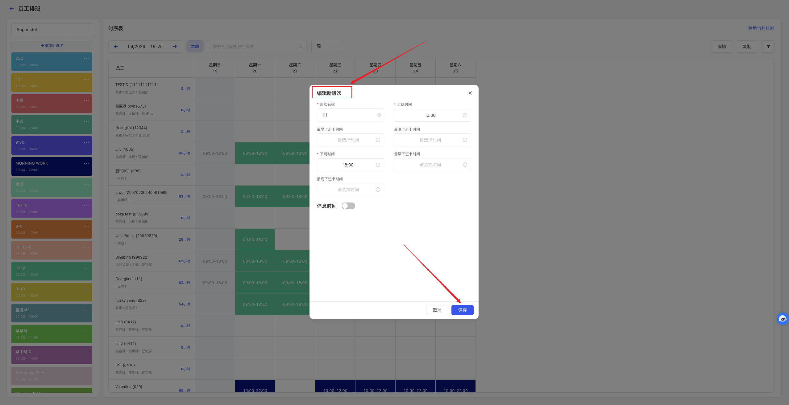
  
图 5：编辑新班次

 

    在 <strong>修改过班次设置</strong> 之后，对员工排班表上已经排好的班次也会进行更新。
  

  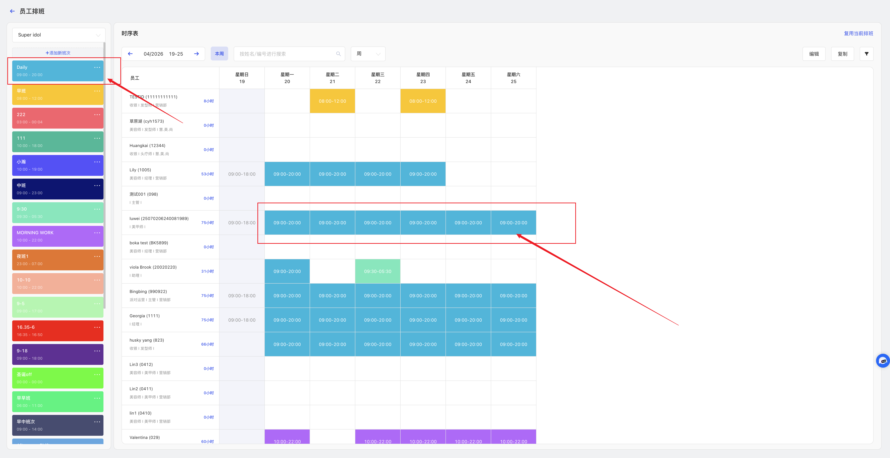
  
图 6：排班表更新

<!-- ---------- 步骤 3：对员工进行排班 ---------- -->
### 3. 对员工进行排班

  

    在 <strong>员工排班</strong> 页面，点击 <strong>周/月切换</strong> 按钮，可切换对周排班或者是月排班。
  

  
  
图 7：切换时序表

  

    点击右上角 <strong>编辑</strong> 按钮，进入修改员工班次功能。
  

  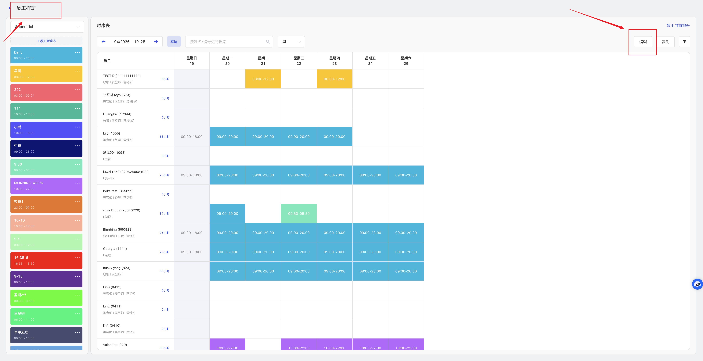
  
图 8：给员工排班

  

    左侧选择 <strong>需要安排的班次</strong> （已选中的班次外面会有蓝色的框），在 <strong>时序表</strong> 点击 <strong>空白格</strong> 可增加选中的班次，点击 <strong>已有班次的格</strong> 可取消之前设置的班次。编辑完成后，点击右上角 <strong>保存</strong> 按钮完成员工排班。
  

  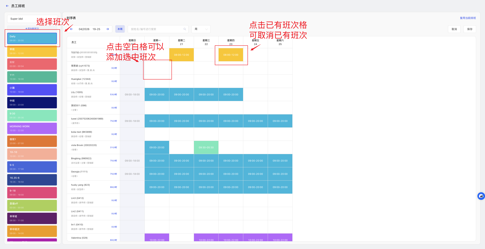
  
图 9：时序表排班

  

    在给所有的员工排好当前页面的班次后，点击右上角 <strong>复用当前排班</strong> ，选择 <strong>开始时间</strong> ， <strong>结束时间</strong> 可以把当前的排班设置复制到选择的时间范围内，简化门店操作。
  

   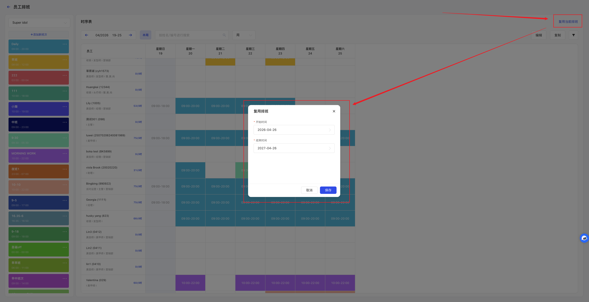
  
图 10：复用排班

<!-- ---------- 步骤 4：修改员工班次 ---------- -->
### 4. 修改员工班次

  

    在 <strong>员工排班</strong> 页面，点击右上角 <strong>编辑</strong> 按钮，进入修改员工班次功能。
  

  
  
图 11：进入班次编辑页面

  

    左侧选择 <strong>需要安排的班次</strong> （已选中的班次外面会有蓝色的框），在<strong>时序表</strong> 点击 <strong>空白格</strong> 可增加选中的班次，点击 <strong>已有班次的格</strong> 可取消之前设置的班次，再点击点击 <strong>空白格</strong> 可增加选中的班次。编辑完成后，点击右上角 <strong>保存</strong> 按钮完成员工排班。
  

  
  
图 12：修改排班

  <!-- ---------- 步骤 5：员工查看班次 ---------- -->
### 5. 员工查看班次

  

    在 <strong>MaAe Staff</strong> APP 中，点击 <strong>管理 → 考勤</strong> 按钮，员工可在这个页面根据当天班次按钮进行上班打卡和下班打卡（需提前进行 <a href="./attendance">考勤设置</a>）。
  

  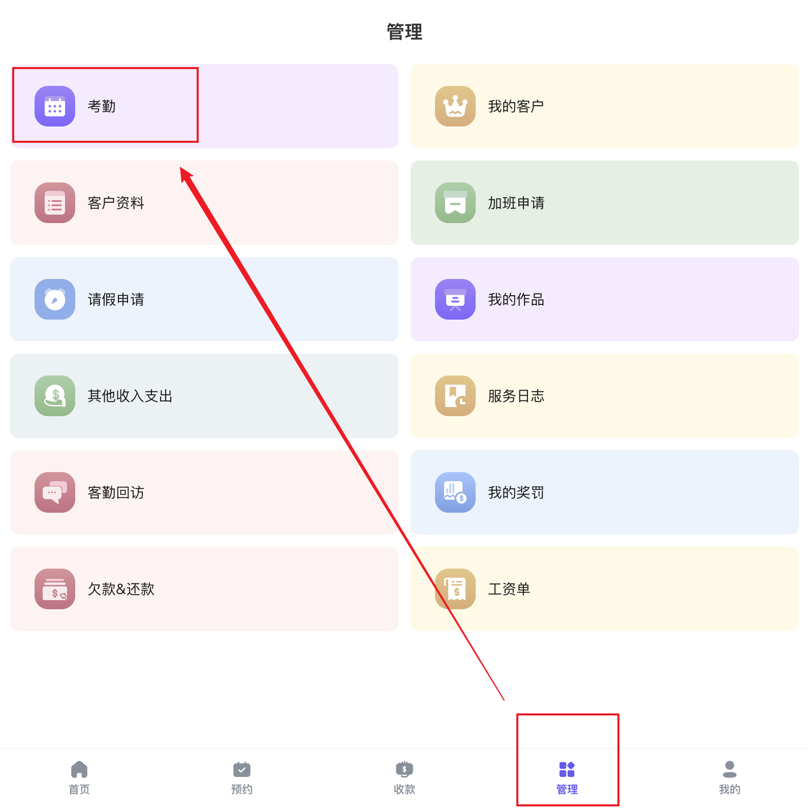
  
图 13：员工考勤打卡页面

  

    在 <strong>员工考勤打卡</strong> 页面，点击<strong>排班</strong> 按钮， 员工可按 <strong>周/月</strong> 查看自己的班次安排情况。
  

  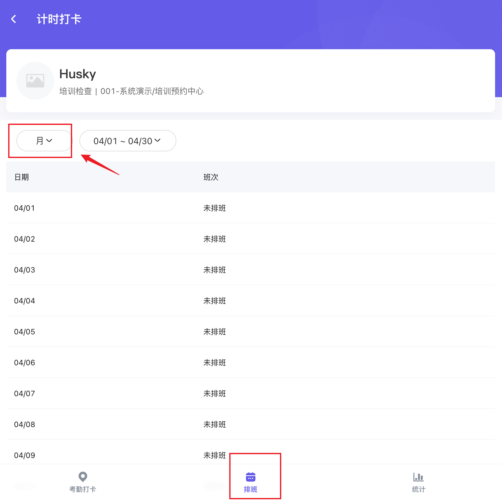
  
图 14：员工查看自己的排班

<!-- ====================== 温馨提示 ====================== -->
## 温馨提示

  <strong>注意 1：</strong> 无法修改 <strong>已过去日期</strong> 的排班，无论是 <strong>修改班次设置</strong> 还是 <strong>修改员工排班</strong> 都不会对之前的日期产生变化。

  <strong>注意 2：</strong> 修改班次名称、上下班时间后，系统会自动同步更新未来已排班的员工班次，但不会影响已过去日期的排班记录。

  <strong>注意 3：</strong> 使用 <strong>复用当前排班</strong> 时，建议先确认目标日期范围内是否已有排班，避免覆盖原有安排。

  <strong>注意 4：</strong> 删除某个班次后，已使用该班次的未来排班记录也会受到影响，建议先确认是否仍有员工正在使用该班次。

  <strong>注意 5：</strong> 排班完成后，建议员工重新登录 <strong>MaSe Staff</strong> App，以确保看到最新的班次安排。

---

<!-- ====================== 关联教程 ====================== -->
## 关联教程

  

    ↗
    <a className="doc-related-text" href="./attendance">
      <strong>员工考勤</strong>
      设置考勤规则、上下班打卡及迟到早退统计
    </a>
  

  

    ↗
    <a className="doc-related-text" href="./payroll">
      <strong>员工工资单</strong>
      查看排班与考勤数据如何同步到工资单中
    </a>
  

  

    ↗
    <a className="doc-related-text" href="./payroll">
      <strong>预约关联员工排班</strong>
      客户在线预约门店服务会关联到员工的上班时间
    </a>
  

