# 工资单管理

<!-- ====================== 核心说明 ====================== -->

  <strong>核心说明：</strong>
  工资单用于汇总员工在指定周期内的薪资构成、提成、小费、奖惩及实发金额，并支持导出和发布到员工端查看。

<!-- ====================== 功能说明 ====================== -->
## 功能说明

<ul className="mobile-list">
  <li><strong>主要用途：</strong>自动汇总员工工资明细，支持导出 Excel，用于财务核算与工资发放。</li>
  <li><strong>业绩关联：</strong>可自动关联业绩提成、小费、奖惩等数据，实时反映员工收入构成。</li>
  <li><strong>员工查看：</strong>已发布的工资单会同步发送到员工端 <strong>MaSe Staff</strong> App，方便员工随时查看。</li>
</ul>

<!-- ====================== 系统字段说明 ====================== -->
### 系统字段说明

  <ul className="key-list compact-list">
    <li><strong>工作时长：</strong>系统根据员工排班、打卡考勤自动计算的上班总时长。</li>
    <li><strong>考勤天数：</strong>系统根据员工排班、打卡考勤自动计算的上班天数。</li>
    <li><strong>账务天数：</strong>员工在账务周期内有服务收银单据的天数总和。</li>
    <li><strong>小费：</strong>系统中分配给该员工的小费金额总和。</li>
    <li><strong>实业绩：</strong>收银单中该员工产生的业绩总和。</li>
    <li><strong>提成：</strong>系统根据业绩提成规则计算出的提成金额总和。</li>
    <li><strong>奖励：</strong>通过 <strong>员工奖惩</strong> 发放给员工的奖励金额总和。</li>
    <li><strong>惩罚：</strong>通过 <strong>员工奖惩</strong> 扣减该员工的金额总和。</li>
  </ul>

<!-- ====================== 操作路径 ====================== -->

  <strong>操作路径：</strong> 设置 → 员工管理 → 工资单

<!-- ====================== 操作视频 ====================== -->
## 操作视频

  

    <iframe
      src="https://www.youtube.com/embed/VSsU9MVqAEs"
      title="YouTube video player"
      frameBorder="0"
      allow="accelerometer; autoplay; clipboard-write; encrypted-media; gyroscope; picture-in-picture; web-share; fullscreen"
      allowFullScreen
      referrerPolicy="strict-origin-when-cross-origin"
    />
  

  

    

      如视频无法播放，请点击下方按钮前往 YouTube 登录观看。
    

    <a
      className="video-btn"
      href="https://www.youtube.com/watch?v=VSsU9MVqAEs"
      target="_blank"
      rel="noopener noreferrer"
    >
      👉 打开 YouTube 观看
    </a>
  

<!-- ====================== 操作步骤 ====================== -->
## 操作步骤

<!-- ---------- 步骤 1：新增工资单模板 ---------- -->
### 1. 新增工资单模板

  

    在 “MaSe” 导航栏中打开 <strong>设置 → 员工管理 → 工资单</strong>，进入工资单页面。
  

  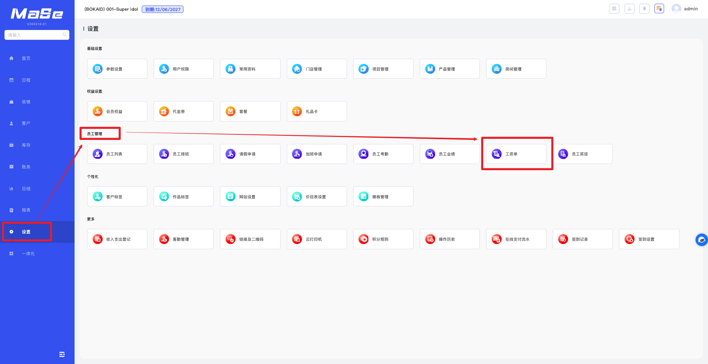
  
图 1：进入工资单页面

  

    在 <strong>工资单</strong> 页面，点击右上角 <strong>模板设置</strong>，进入模板设置页面。
  

  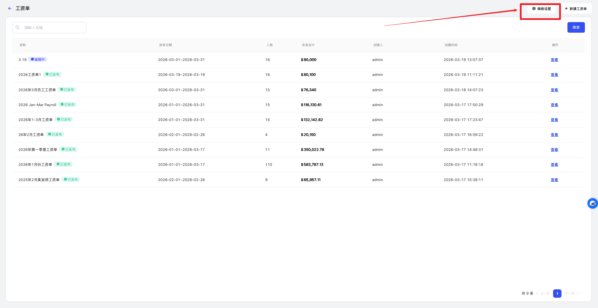
  
图 2：点击模板设置

  

    在 <strong>模板设置</strong> 页面，左侧点击 <strong>添加</strong>，输入 <strong>模板名称</strong> 后点击 <strong>保存</strong>，即可创建新模板。
  

  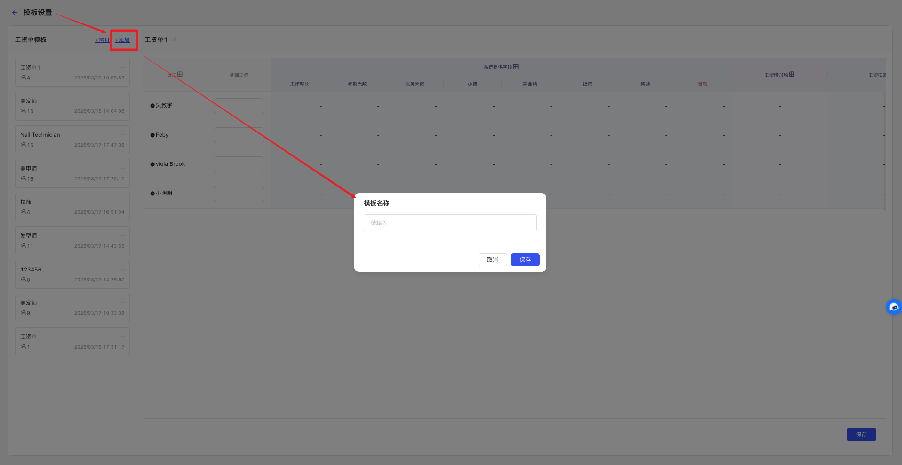
  
图 3：新增工资单模板

<!-- ---------- 步骤 2：修改工资单模板内容 ---------- -->
### 2. 修改工资单模板内容

  

    在 <strong>模板设置</strong> 页面，点击需要修改的工资单模板，左上角会显示当前已选择的模板名称。
  

  

    在模板中点击对应板块的 <strong>➕</strong> 按钮，可添加不同字段；设置完成后点击 <strong>保存</strong>。
  

  <ul className="key-list compact-list">
    <li><strong>员工：</strong>添加本工资单需要关联的员工信息。</li>
    <li><strong>系统提供字段：</strong>添加系统中记录的员工工资相关数据，例如 <strong>工作时长</strong>、<strong>账务天数</strong>、<strong>提成</strong>、<strong>奖励</strong> 等。</li>
    <li><strong>工资增加项：</strong>添加额外奖励或补贴项目。</li>
    <li><strong>工资扣减项：</strong>添加工资扣减项目。</li>
  </ul>

  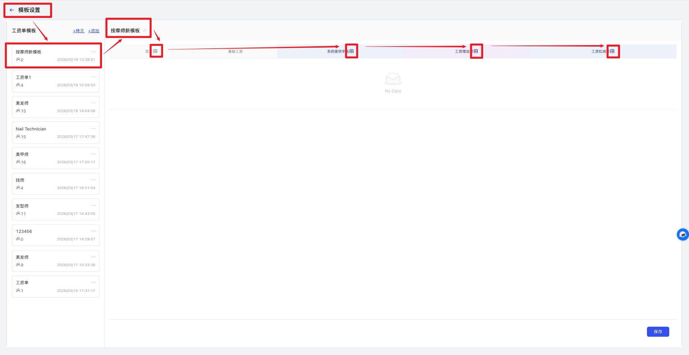
  
图 4：设置工资单模板内容

<!-- ---------- 步骤 3：新建工资单 ---------- -->
### 3. 新建工资单

  

    在 <strong>工资单</strong> 页面，点击右上角 <strong>新建工资单</strong>，进入新建工资单页面。
  

  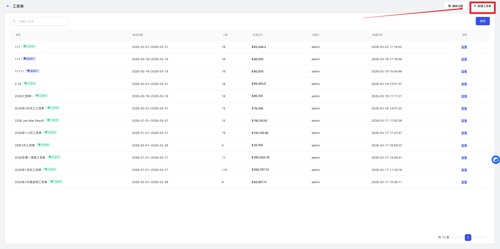
  
图 5：点击新建工资单

  

    选择 <strong>模板</strong>，输入 <strong>名称</strong>，并设置 <strong>账务日期</strong>，完成后点击 <strong>保存</strong>，即可创建新的工资单。
  

  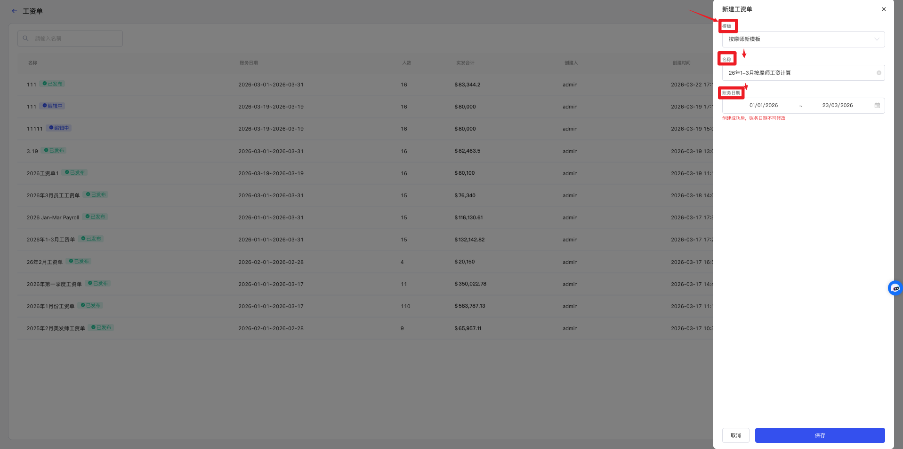
  
图 6：填写工资单信息

  

    创建完成后，在工资单列表中找到对应记录，点击后方的 <strong>查看</strong>，进入工资单详情页面。
  

  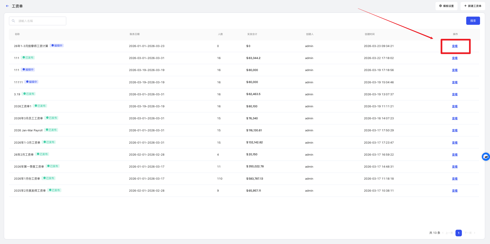
  
图 7：查看工资单详情

  

    在工资单详情页面，点击右上角 <strong>编辑</strong>，进入工资单详情编辑页面。
  

  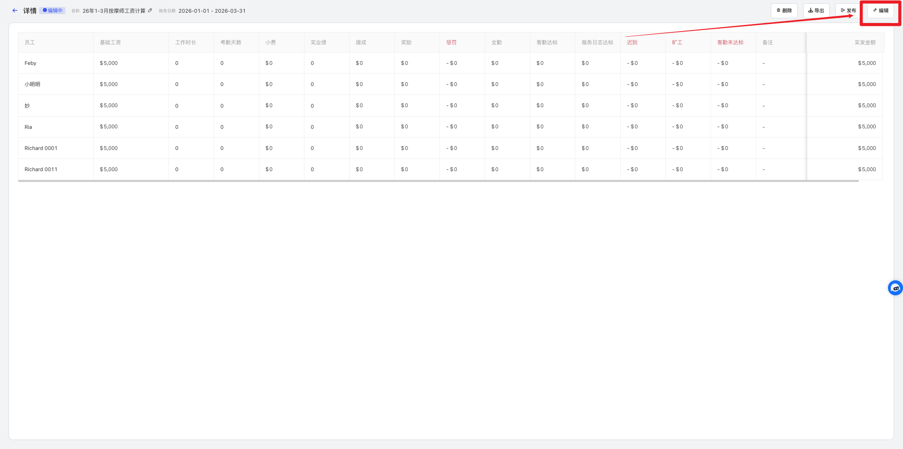
  
图 8：编辑工资单

  

    在详情编辑页面，点击上方的 <strong>刷新</strong> 按钮，系统会自动带入相关数据；补充其他工资字段后，点击 <strong>保存</strong>。
  

  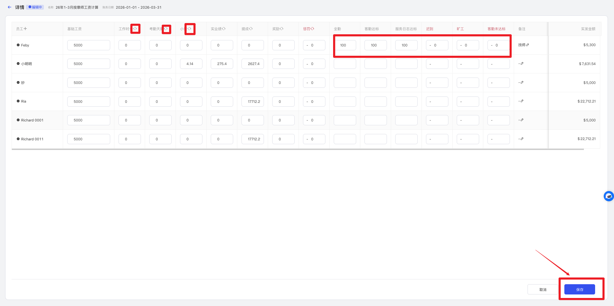
  
图 9：刷新并保存工资单

<!-- ---------- 步骤 4：发布工资单 ---------- -->
### 4. 发布工资单

  

    在工资单页面中，点击对应工资单后的 <strong>查看</strong>，进入工资单详情页面。
  

  
  
图 10：进入工资单详情页

  

    在详情页面点击右上角 <strong>发布</strong>，再点击 <strong>确定</strong>，即可完成工资单发布。
  

  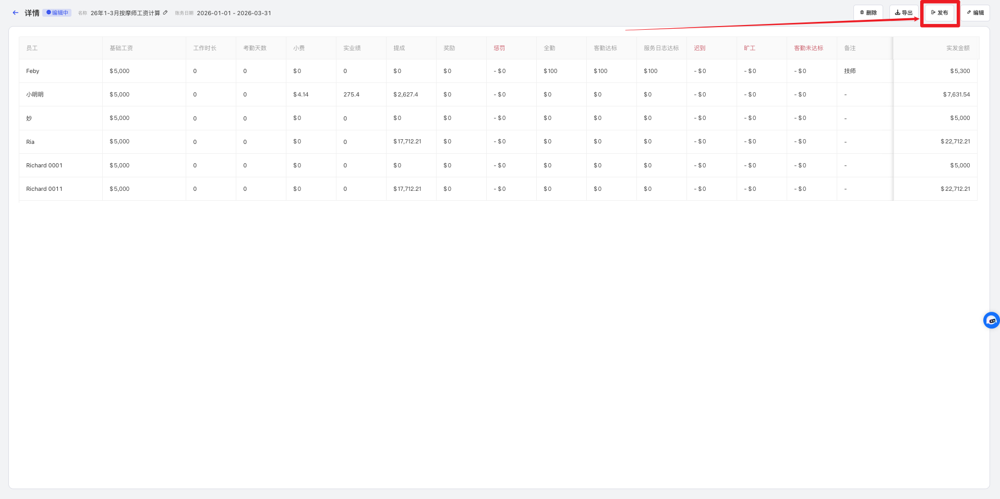
  
图 11：发布工资单

  

    发布后，员工可在 <strong>MaSe Staff</strong> 中通过 <strong>管理 → 工资单</strong> 查看已发布的工资单。
  

  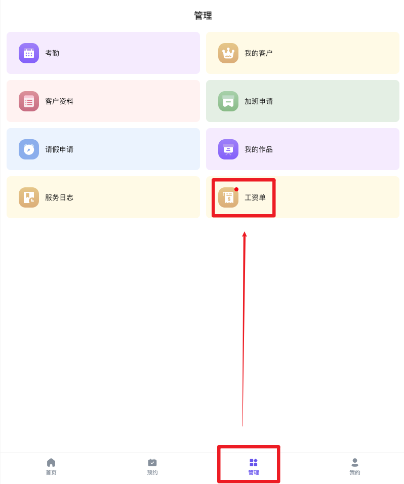
  
图 12：员工端查看工资单

<!-- ====================== 温馨提示 ====================== -->
## 温馨提示

  <strong>注意 1：</strong> 工资单的 <strong>账务日期</strong> 在创建成功后不可修改。

  <strong>注意 2：</strong> 已发布的工资单如需修改，需先在详情页中点击 <strong>撤回发布</strong>，再进行编辑。

