# 积分规则

<!-- ====================== 核心说明 ====================== -->

  <strong>核心说明：</strong>
  积分规则用于设定会员积分的获取、消耗及有效期规则，是会员体系的重要组成部分。

<!-- ====================== 功能说明 ====================== -->
## 功能说明

<ul className="mobile-list">
  <li><strong>积分获取：</strong>支持消费、推荐、新增客户等多种积分来源设置。</li>
  <li><strong>积分消耗：</strong>支持按比例抵扣金额（如 1 元 = 10 积分）。</li>
  <li><strong>有效期控制：</strong>可设置积分有效期，提升客户复购率。</li>
  <li><strong>规则联动：</strong>支持与项目、产品、权益等模块联动设置。</li>
</ul>

<!-- ====================== 积分机制说明 ====================== -->
### 积分机制说明

  <ul className="key-list compact-list">
    <li><strong>积分获取：</strong>通过消费、推荐、注册等行为获得积分。</li>
    <li><strong>积分消耗：</strong>积分可用于抵扣消费金额。</li>
    <li><strong>积分有效期：</strong>每笔积分可设置独立有效时间。</li>
    <li><strong>积分展示：</strong>客户可在 App 中查看积分及规则说明。</li>
  </ul>

<!-- ====================== 操作路径 ====================== -->

  <strong>操作路径：</strong> 设置 → 更多 → 积分规则

---

<!-- ====================== 操作视频 ====================== -->
## 操作视频

  

    <iframe
      src="https://www.youtube.com/embed/gXbwSO3L2VI"
      title="YouTube video player"
      frameBorder="0"
      allow="accelerometer; autoplay; clipboard-write; encrypted-media; gyroscope; picture-in-picture; web-share; fullscreen"
      allowFullScreen
      referrerPolicy="strict-origin-when-cross-origin"
    />
  

  

    

      如视频无法播放，请点击下方按钮前往 YouTube 登录观看。
    

    <a
      className="video-btn"
      href="https://www.youtube.com/watch?v=VSsU9MVqAEs"
      target="_blank"
      rel="noopener noreferrer"
    >
      👉 打开 YouTube 观看
    </a>
  

<!-- ====================== 操作步骤 ====================== -->
## 操作步骤

<!-- ---------- 步骤 1：积分获取设置 ---------- -->
### 1. 积分获取设置

  

    进入积分规则页面，设置积分获取方式及比例。
  

  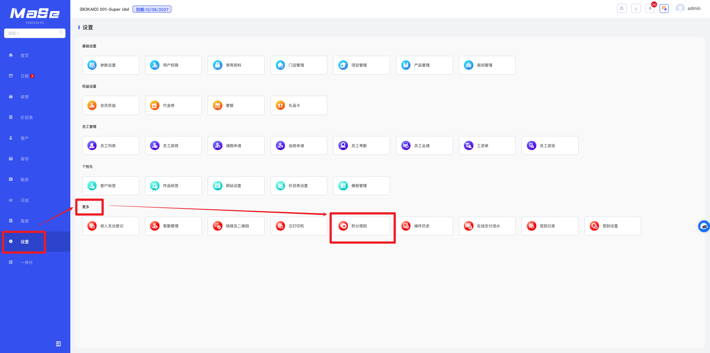
  
图 1：积分规则页面

  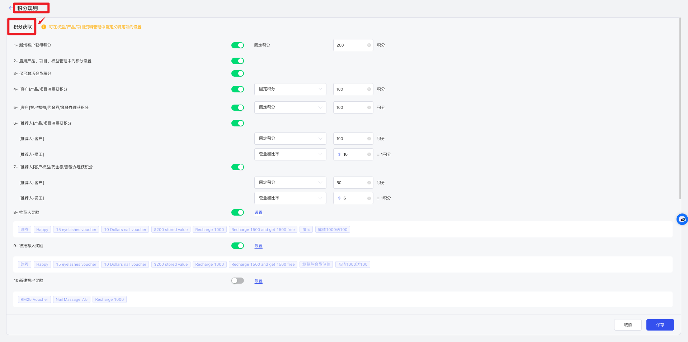
  
图 2：积分获取设置

  

    点击 <strong>支付方式设置</strong> 可设置不同支付方式的积分比例。
  

  

    点击 <strong>额外积分设置</strong> 可设置叠加规则。
  

  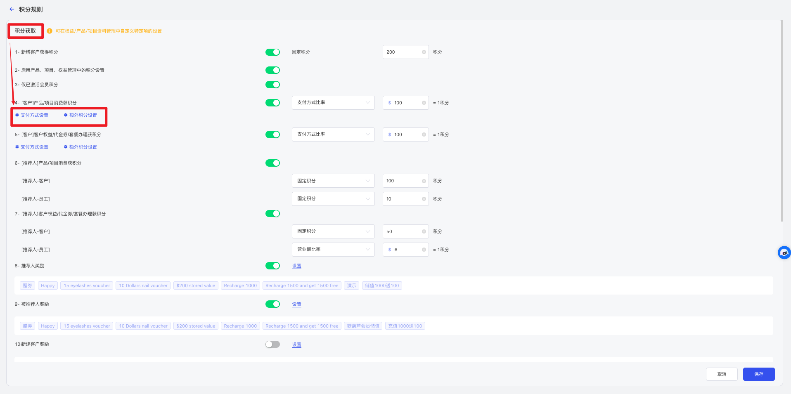
  
图 3：积分扩展设置

  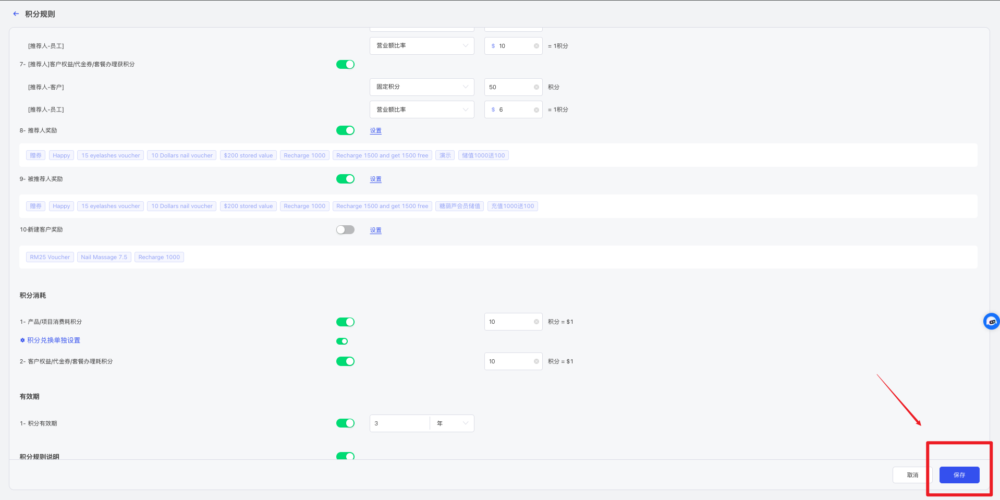
  
图 4：保存设置

<!-- ---------- 步骤 2：积分消耗设置 ---------- -->
### 2. 积分消耗设置

  

    设置积分抵扣比例及消耗规则。
  

  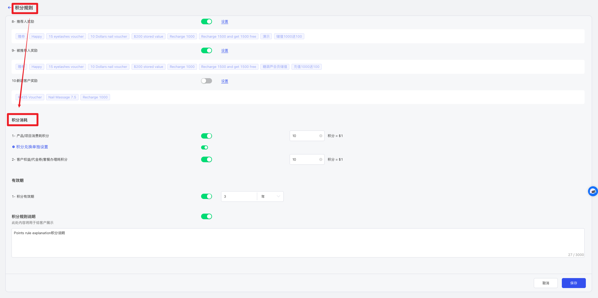
  
图 5：积分消耗设置

  

    点击 <strong>积分兑换单独设置</strong>，可针对特定项目或产品设置不同规则。
  

  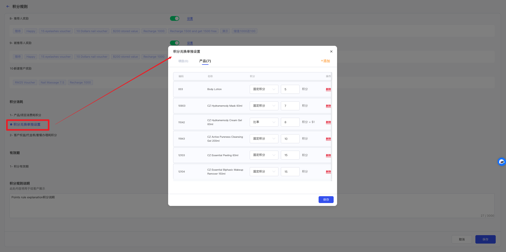
  
图 6：特殊兑换设置

  
  
图 7：保存设置

<!-- ---------- 步骤 3：积分有效期设置 ---------- -->
### 3. 积分有效期设置

  

    设置积分有效期。
  

  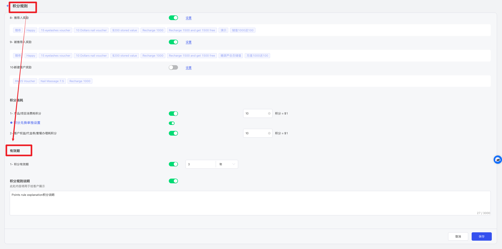
  
图 8：有效期设置

  
  
图 9：保存设置

<!-- ---------- 步骤 4：积分规则说明设置 ---------- -->
### 4. 积分规则说明设置

  

    设置展示给客户的积分规则说明内容。
  

  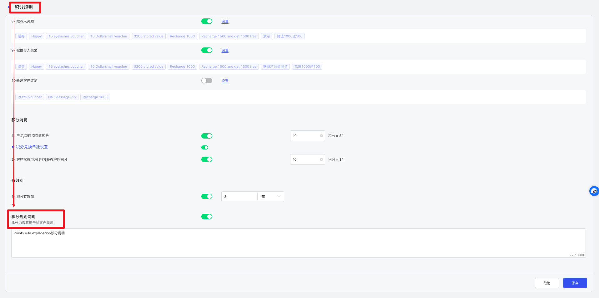
  
图 10：规则说明设置

  

    开启后，客户可在 App 中查看积分规则说明。
  

  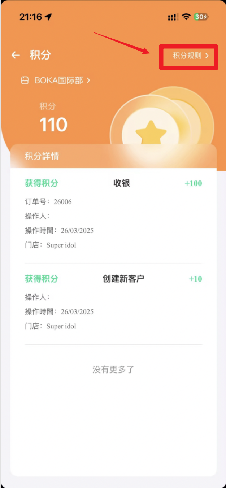
  
图 11：客户端展示

<!-- ---------- 步骤 5：查询客户积分 ---------- -->
### 5. 查询客户积分

  

    在客户详情中查看积分余额及变动记录。
  

  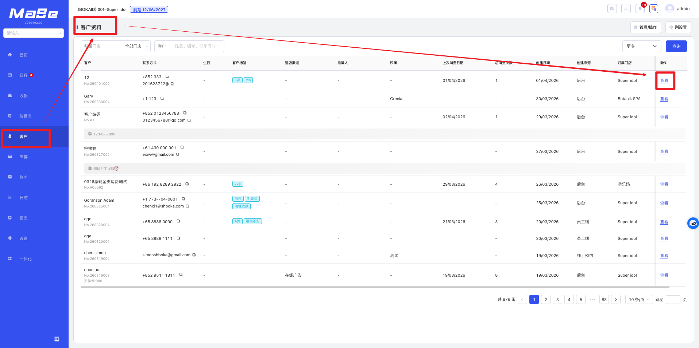
  
图 12：客户详情

  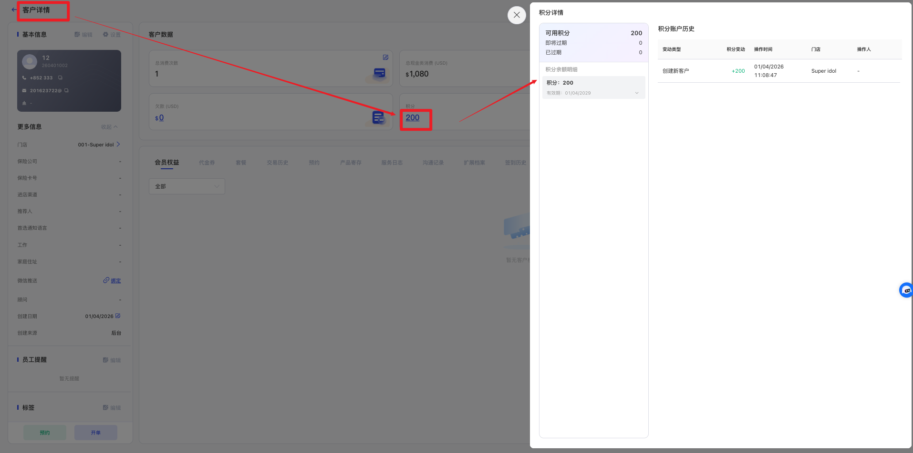
  
图 13：积分明细

  

    支持手动调整客户积分。
  

  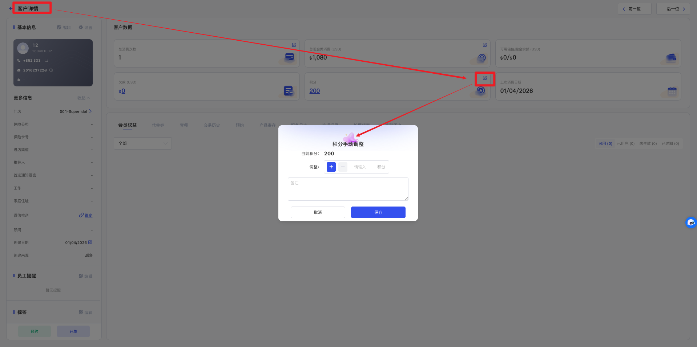
  
图 14：手动调整积分

<!-- ---------- 步骤 6：客户自行查询积分 ---------- -->
### 6. 客户自行查询积分

  

    在 MaSe 手机端 APP 或门店预约链接中，客户可在“我的”页面点击积分，进入积分页面查看积分余额及变动记录。
  

  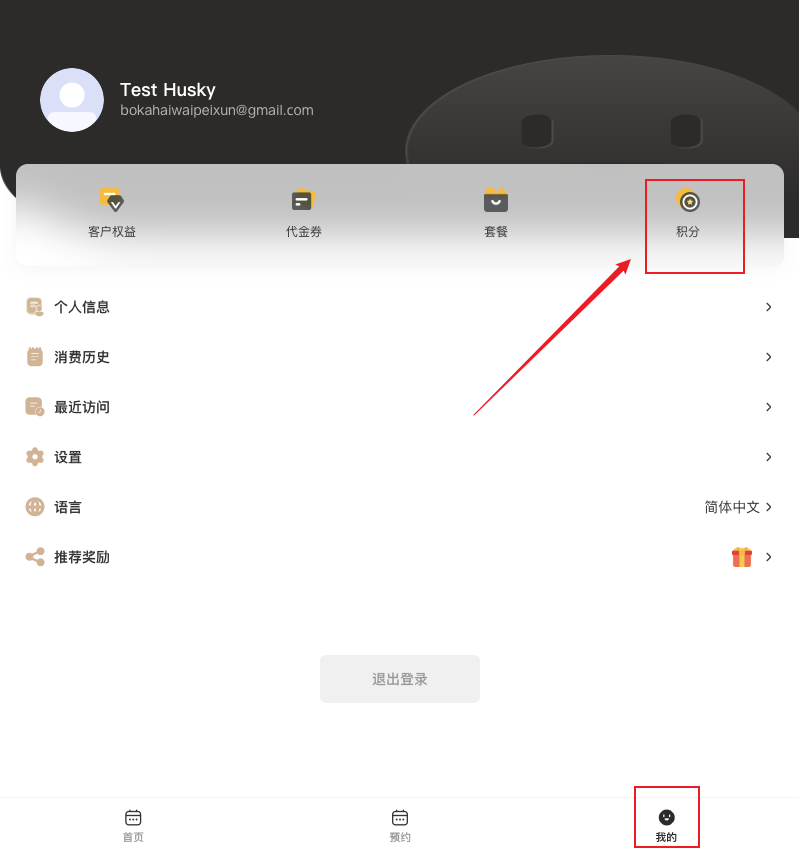
  
图 15：客户端积分查询

---

<!-- ====================== 温馨提示 ====================== -->
## 温馨提示

  <strong>注意 1：</strong> 积分规则保存后，仅对新产生的业务生效，不会自动影响历史订单或历史积分。

  <strong>注意 2：</strong> 如果项目、产品或权益单独设置了积分规则，则会优先生效，系统总规则不会覆盖单独规则。

  <strong>注意 3：</strong> 仅已激活会员状态的客户才可正常获得积分。

  <strong>注意 4：</strong> 客户端展示的积分规则说明需手动开启，否则客户无法在 App 中查看。

---

<!-- ====================== 积分规则说明 ====================== -->
## 积分规则说明

  <ul className="key-list compact-list">
    <li><strong>新增客户获得积分：</strong>新添加客户信息后可自动获得积分。</li>

    <li>
      <strong>启用产品 / 项目 / 权益积分规则：</strong>
      若单独设置积分规则，则会优先生效。
        

      • 项目路径：设置 → 基础设置 → 项目管理 → 编辑项目 → 积分获取规则
       

      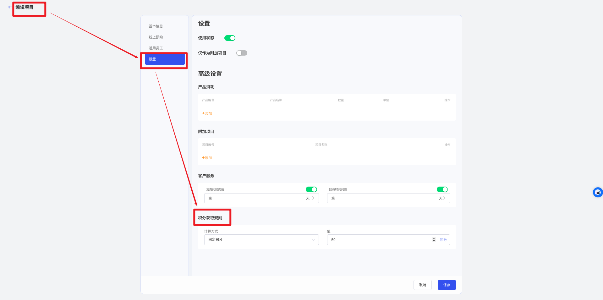

       

      • 产品路径：设置 → 基础设置 → 产品管理 → 编辑产品 → 积分获取规则
       

      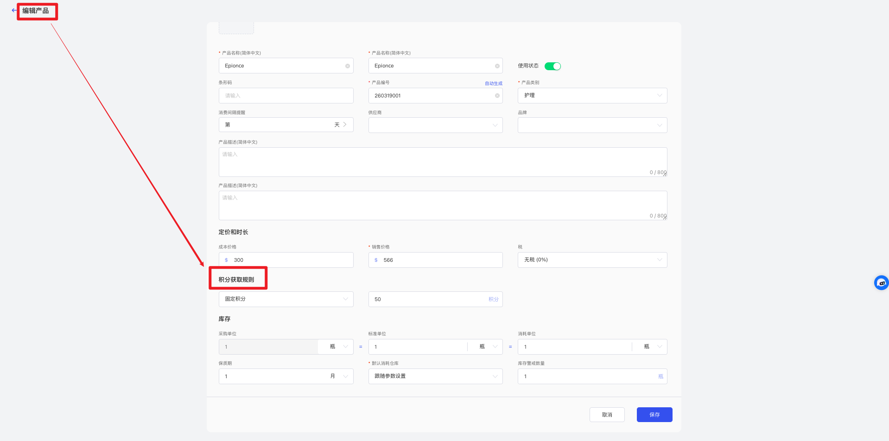

       

      • 权益路径：设置 → 权益设置 → 会员权益 → 编辑客户权益 → 积分获取规则
       

      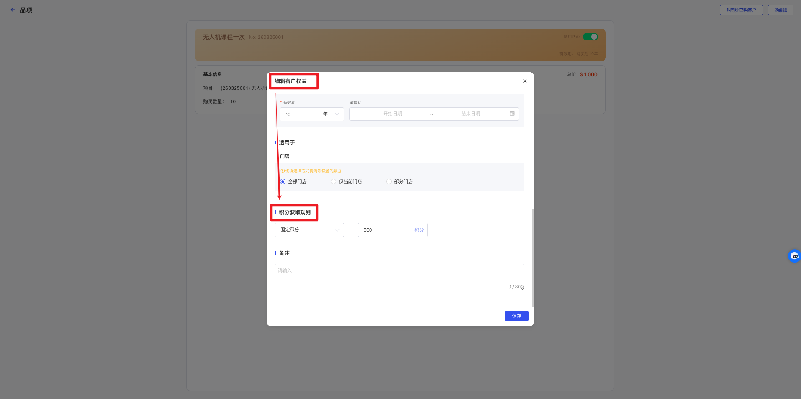

       

      • “代金券 / 套餐 / 礼品卡”规则与权益类似。
    </li>

    <li>
      <strong>仅已激活会员积分：</strong>
      仅开启会员状态的客户才可获得积分。
       

      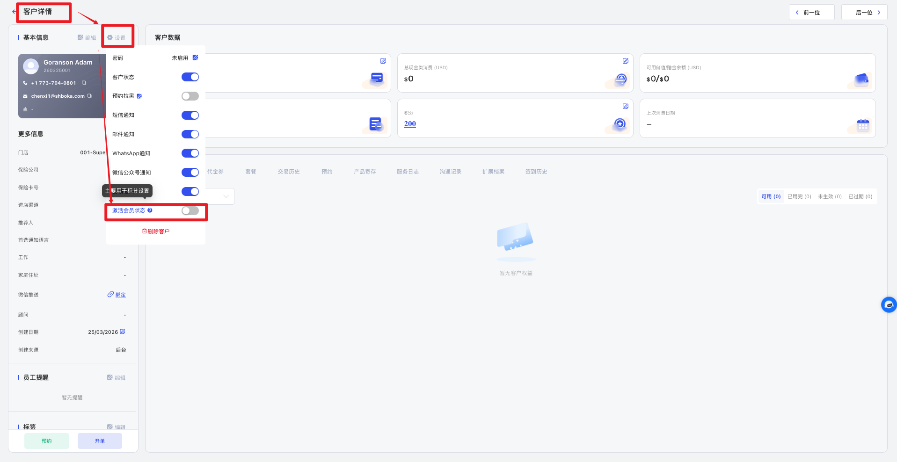
    </li>

    <li><strong>客户消费获得积分：</strong>消费项目或产品后可获得积分。</li>

    <li><strong>客户办理权益获得积分：</strong>购买权益类产品后可获得积分。</li>

    <li><strong>推荐人消费奖励：</strong>被推荐客户消费时，推荐人可获得积分。</li>

    <li><strong>推荐人办理奖励：</strong>被推荐客户购买权益时，推荐人可获得积分。</li>

    <li><strong>推荐人邀请奖励：</strong>邀请客户注册成功后，推荐人可获得积分。</li>

    <li><strong>被推荐人奖励：</strong>新客户注册成功后可获得积分。</li>

    <li><strong>新建客户奖励：</strong>所有注册客户均可获得积分。</li>
  </ul>

