# 推荐人功能设置

<!-- ====================== 核心说明 ====================== -->

  <strong>核心说明：</strong>
  推荐人功能用于建立客户与推荐人之间的关联关系，帮助门店自动统计推荐来源，并根据消费或注册行为发放奖励。

<!-- ====================== 功能说明 ====================== -->
## 功能说明

<ul className="mobile-list">
  <li>
    <strong>推荐奖励：</strong>当被推荐客户完成消费或注册后，推荐人可获得积分或奖励。
  </li>
  <li>
    <strong>来源追踪：</strong>可统计不同客户或员工带来的新客数量及转化情况。
  </li>
  <li>
    <strong>自动计算：</strong>系统会根据积分规则自动计算推荐奖励，无需人工登记。
  </li>
</ul>

<!-- ====================== 推荐奖励说明 ====================== -->
### 推荐奖励说明

  <ul className="key-list compact-list">
    <li>
      <strong>推荐人消费奖励：</strong>被推荐客户消费产品、项目、客户权益、代金券或套餐时，推荐人可获得积分。
    </li>
    <li>
      <strong>推荐注册奖励：</strong>推荐人通过分享邀请链接或二维码，邀请新客户注册成功后可获得奖励。
    </li>
    <li>
      <strong>被推荐人奖励：</strong>被推荐客户完成注册认证后，也可获得系统设置的奖励。
    </li>
    <li>
      <strong>推荐人身份：</strong>推荐人可分为客户或员工，两种身份可分别设置不同奖励比例。
    </li>
  </ul>

<!-- ====================== 操作路径 ====================== -->

  <strong>操作路径：</strong> 设置 → 更多 → 积分规则

<!-- ====================== 操作视频（暂不启用） ====================== -->
{/*
## 操作视频

  

    <iframe
      src="https://www.youtube.com/embed/VSsU9MVqAEs"
      title="YouTube video player"
      frameBorder="0"
      allow="accelerometer; autoplay; clipboard-write; encrypted-media; gyroscope; picture-in-picture; web-share; fullscreen"
      allowFullScreen
      referrerPolicy="strict-origin-when-cross-origin"
    />
  

  

    

      如视频无法播放，请点击下方按钮前往 YouTube 登录观看。
    

    <a
      className="video-btn"
      href="https://www.youtube.com/watch?v=VSsU9MVqAEs"
      target="_blank"
      rel="noopener noreferrer"
    >
      👉 打开 YouTube 观看
    </a>
  

*/}

<!-- ====================== 操作步骤 ====================== -->
## 操作步骤

<!-- ---------- 步骤 1：设置积分获取规则 ---------- -->
### 1. 设置积分获取规则

  
1. 设置积分获取规则

  

    进入 <strong>设置 → 更多 → 积分规则</strong> 页面。
  

  
  
图 1：积分规则页面

  

    在 <strong>积分获取</strong> 栏位中，设置 <strong>[推荐人] 产品/项目消费获积分</strong>，推荐人可在被推荐客户消费产品或项目时获得积分。
  

  

    推荐人身份可分为 <strong>客户</strong> 或 <strong>员工</strong>，分别设置不同积分比例。
  

  

    设置 <strong>[推荐人] 客户权益/代金券/套餐办理获积分</strong>，推荐人可在被推荐客户购买权益、代金券或套餐时获得积分。
  

  

    设置 <strong>推荐人奖励</strong>，当推荐人通过手机端邀请其他人注册成功后可获得奖励。
  

  

    设置 <strong>被推荐人奖励</strong>，当被推荐客户完成注册后，也可获得系统设置的奖励。
  

  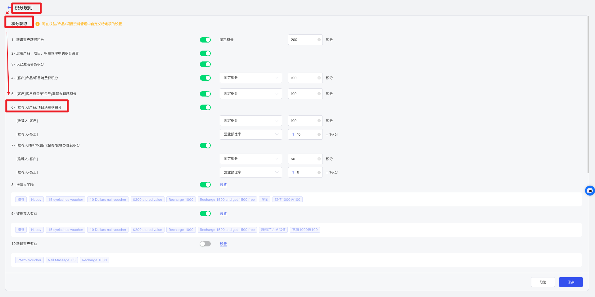
  
图 2：推荐人积分规则设置

<!-- ---------- 步骤 2：推荐人分享邀请 ---------- -->
### 2. 推荐人分享邀请

  
2. 推荐人分享邀请

  

    在 <strong>MaSe 手机端 APP</strong> 或 <strong>门店预约链接</strong> 中，进入首页并打开对应门店详情。
  

  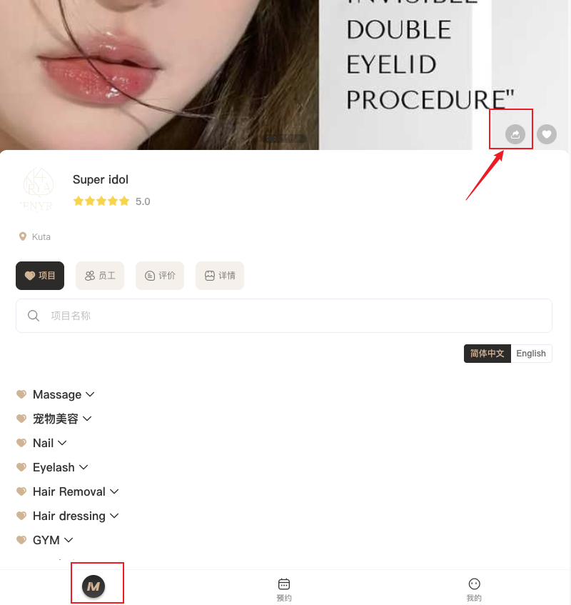
  
图 3：门店详情页

  

    点击 <strong>分享</strong> 按钮，打开邀请链接及邀请二维码。
  

  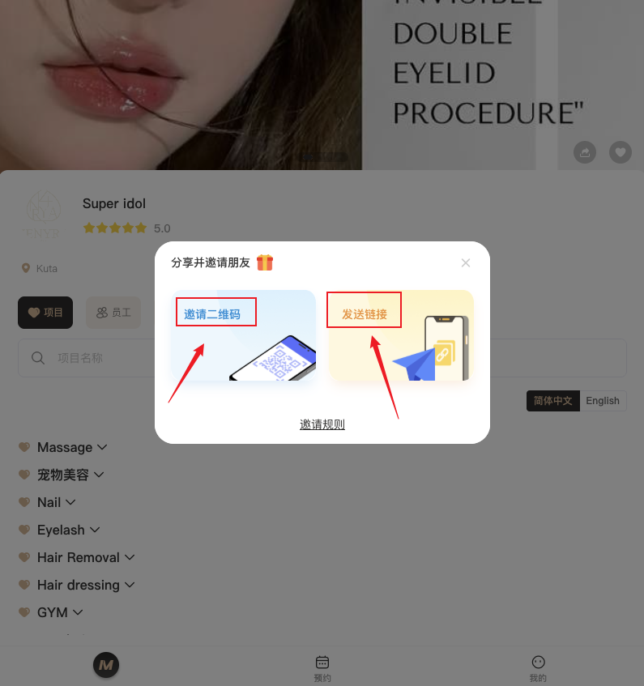
  
图 4：邀请链接与二维码

  

    保存邀请二维码或邀请链接，并通过其他渠道发送给被推荐人。
  

  

    推荐人可在 <strong>我的 → 推荐奖励</strong> 中查看被推荐人成功认证后的奖励。
  

  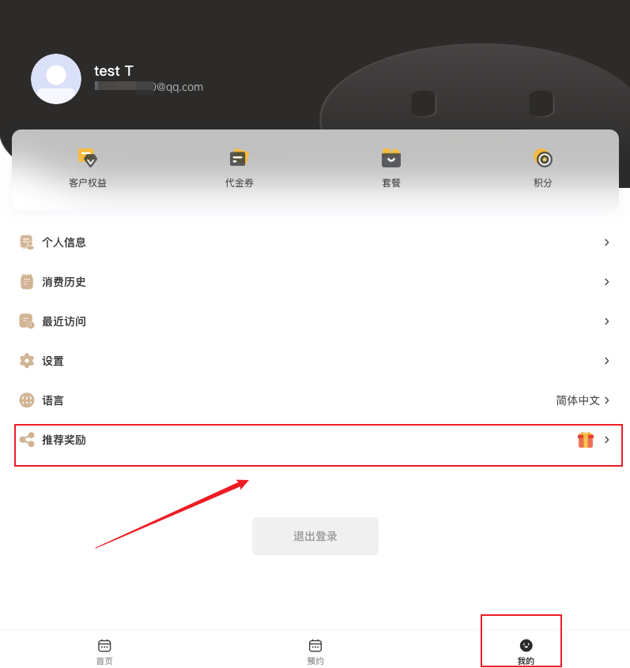
  
图 5：推荐奖励页面

  

    在推荐奖励页面中可以查看获得奖励的日期及详细内容。
  

  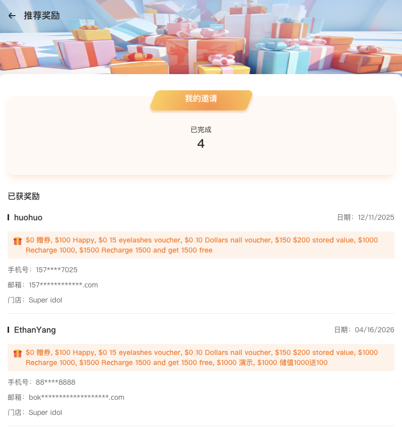
  
图 6：推荐奖励明细

<!-- ---------- 步骤 3：被推荐人领取奖励 ---------- -->
### 3. 被推荐人领取奖励

  
3. 被推荐人领取奖励

  

    被推荐人打开邀请二维码或邀请链接，进入 <strong>被推荐人信息填写</strong> 页面。
  

  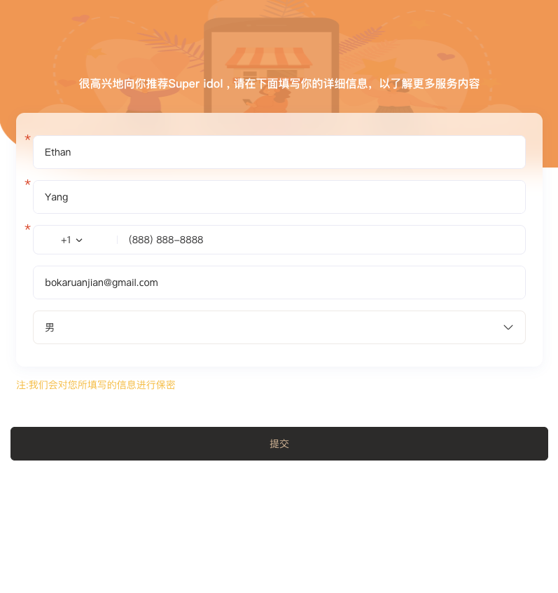
  
图 7：填写被推荐人信息

  

    输入相关信息并点击 <strong>提交</strong>，系统会要求输入邮箱验证码确认身份真实性。
  

  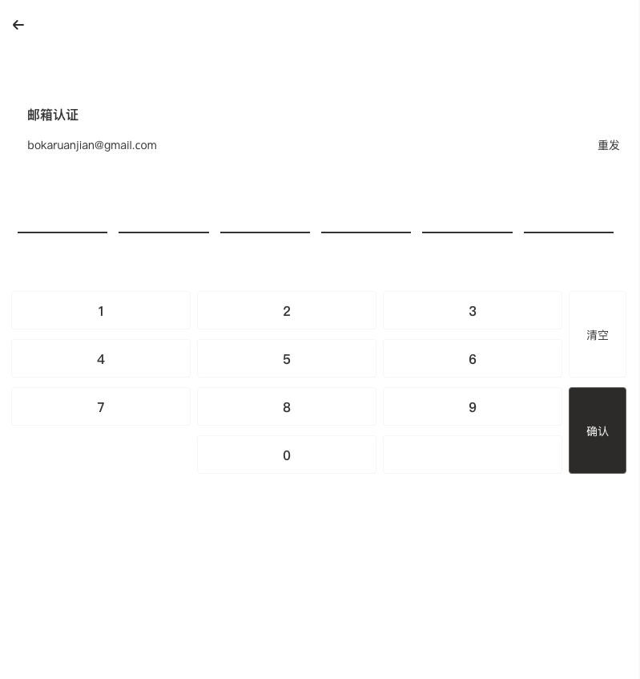
  
图 8：邮箱验证码验证

  

    输入邮箱验证码并点击 <strong>确认</strong>，完成身份认证。
  

  

    完成认证后，系统会自动推送获得的奖励。
  

  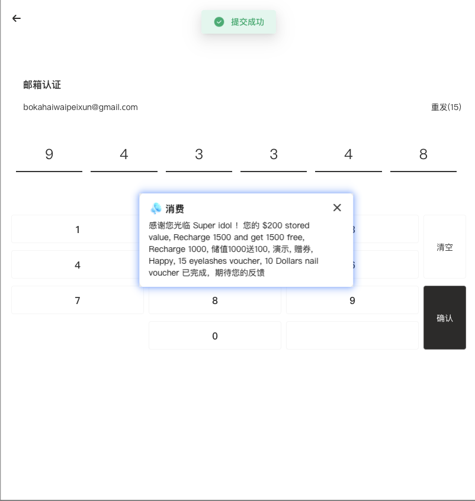
  
图 9：奖励发放提示

  

    被推荐人可在 <strong>我的</strong> 页面中的个人剩余板块查看获得的奖励。
  

  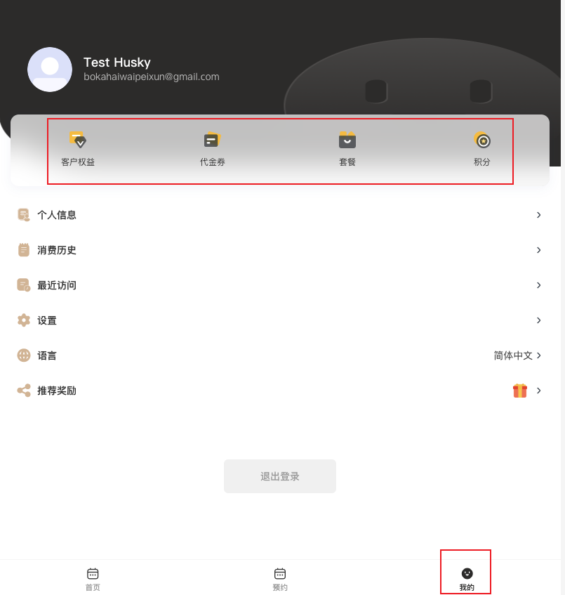
  
图 10：查看奖励

<!-- ---------- 步骤 4：被推荐人消费推荐人获得积分 ---------- -->
### 4：被推荐人消费，推荐人获得积分

  
4：被推荐人消费，推荐人获得积分

  

    被推荐人在门店消费之后，推荐人可在 <strong>MaSe 手机端 APP </strong> 或 <strong>门店预约链接</strong> 中，点击 <strong>我的 - 积分</strong> 栏位，
  

  
  
图 11：进入积分页面

  

    查看根据系统后台设定获得的 <strong>推荐人积分奖励</strong> 明细。
  

  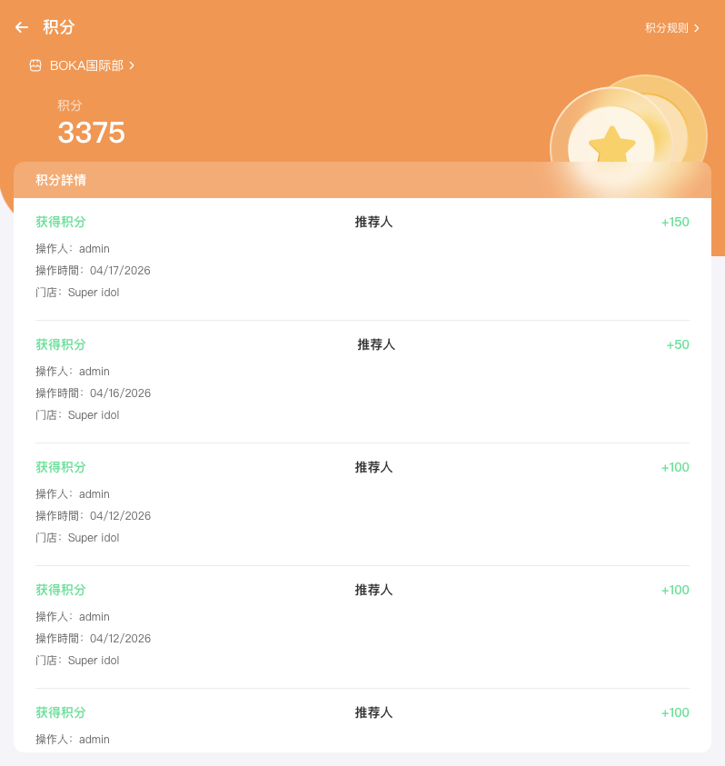
  
图 12：推荐人积分奖励明细

<!-- ---------- 步骤 5：推荐人获得的奖励如何做废 ---------- -->
### 5：推荐人获得的奖励如何做废

  
5：推荐人获得的奖励如何做废

  

    <strong>推荐人</strong> 或 <strong>被推荐人</strong> 获得的奖励，在 <strong>完全没有使用前</strong> ，是可以 <strong>做废</strong> 的。打开软件后台 <strong>客户</strong>功能，通过 <strong>邮箱/手机号/姓名</strong> 查询要做废奖励的客户。点击 <strong>查看</strong> 按钮进入客户详情页面。
  

  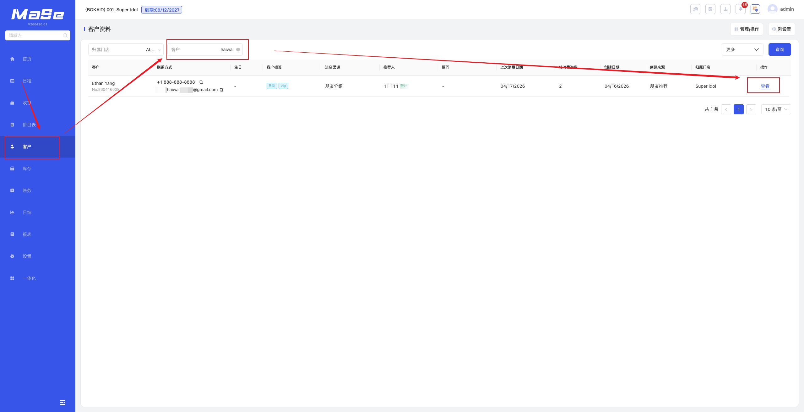
  
图 11：查询客户

  

    在 <strong>客户详情</strong> 页面，点击 <strong>交易历史</strong> 找到之前赠送的历史，点击 <strong>查看</strong> 按钮，打开单据详情页面。
  

  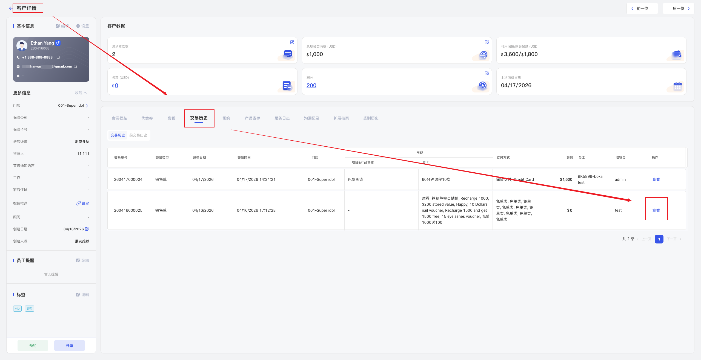
  
图 12：查看赠送记录

  

    在 <strong>单据详情</strong> 页面，点击右上角 <strong>做废</strong> 按钮，<strong>确定做废</strong>订单。做废成功后，之前获得的奖励会在消失。
  

  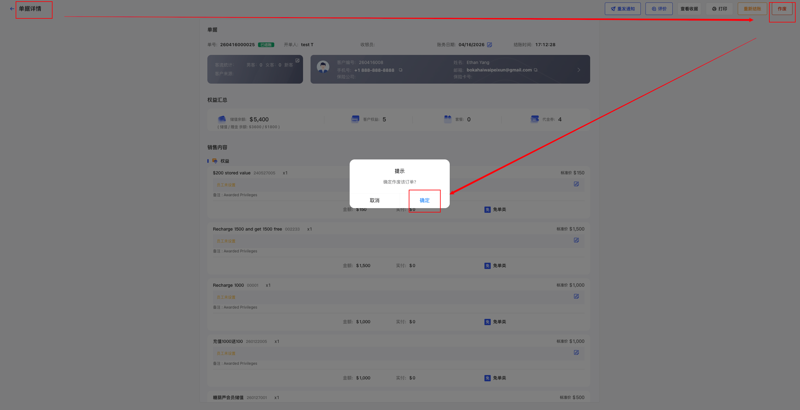
  
图 13：做废赠送记录

<!-- ====================== 温馨提示 ====================== -->
## 温馨提示

  <strong>注意 1：</strong> 推荐奖励需先在积分规则中完成设置，否则推荐成功后不会自动发放积分或奖励。

  <strong>注意 2：</strong> 推荐人可分为客户或员工，两种身份可分别设置不同奖励比例。

  <strong>注意 3：</strong> 被推荐人需完成邮箱验证码认证后，系统才会判定推荐成功并发放奖励。

  <strong>注意 4：</strong> 同一客户通常只能绑定一个推荐人，绑定后不可重复归属到其他推荐人。

