# Godaddy 域名证书配置

<!-- ====================== 核心说明 ====================== -->

  <strong>核心说明：</strong>
  Godaddy 域名证书配置用于将自定义域名绑定到系统，并通过 SSL 证书启用 HTTPS 安全访问，确保顾客访问网站时更加安全可靠。

<!-- ====================== 功能说明 ====================== -->
## 功能说明

<ul className="mobile-list">
  <li>
    <strong>域名绑定：</strong>支持将已购买的自定义域名绑定到系统网站。
  </li>
  <li>
    <strong>DNS 配置：</strong>支持通过CNAME 记录方式完成域名解析。
  </li>
  <li>
    <strong>SSL 安全：</strong>支持上传 SSL 证书，实现 HTTPS 安全访问。
  </li>
  <li>
    <strong>统一管理：</strong>所有域名、DNS 记录及证书信息集中在 Godaddy 后台统一维护。
  </li>
</ul>

<!-- ====================== 系统字段说明 ====================== -->
### 系统字段说明

  <ul className="key-list compact-list">
    <li>
      <strong>域名：</strong>用户购买并需要绑定到系统的自定义网址，例如 example.com。
    </li>
    <li>
      <strong>A 记录：</strong>将域名直接指向服务器 IP 地址的 DNS 配置方式。
    </li>
    <li>
      <strong>CNAME 记录：</strong>将子域名指向另一个域名的 DNS 配置方式。
    </li>
    <li>
      <strong>SSL 证书：</strong>用于启用 HTTPS 安全访问的加密证书文件。
    </li>
    <li>
      <strong>DNS 生效时间：</strong>域名解析更新后，通常需要数分钟至数小时才会完全生效。
    </li>
  </ul>

<!-- ====================== 操作路径 ====================== -->

  <strong>操作路径：</strong> Godaddy → 域名 → DNS 管理 → SSL 证书

---

## 操作视频

  <iframe
    width="100%"
    height="500"
    src="https://www.youtube.com/embed/F_klAYmgrTI"
    title="YouTube video player"
    frameBorder="0"
    allow="accelerometer; autoplay; clipboard-write; encrypted-media; gyroscope; picture-in-picture; web-share; fullscreen"
    allowFullScreen
    referrerPolicy="strict-origin-when-cross-origin"
    style={{ border: 0, borderRadius: '12px'}}
  />

  如视频无法播放（例如无痕模式或未登录 Google），请点击下方按钮前往 YouTube 登录观看。

<a
  href="https://www.youtube.com/watch?v=F_klAYmgrTI"
  target="_blank"
  rel="noopener noreferrer"
  style={{
    display: 'inline-block',
    marginTop: '8px',
    padding: '10px 16px',
    background: '#2e8555',
    color: '#fff',
    borderRadius: '8px',
    textDecoration: 'none',
    fontWeight: 'bold',
  }}
>
  👉 打开 YouTube 观看（支持登录 / 全屏）
</a>

---

<!-- ====================== 操作步骤 ====================== -->
## 操作步骤

  <a href="#step-1" className="doc-anchor-card">1. 购买域名</a>
  <a href="#step-2" className="doc-anchor-card">2. 进入 DNS 管理</a>
  <a href="#step-3" className="doc-anchor-card">3. 配置域名解析</a>
  <a href="#step-4" className="doc-anchor-card">4. 导入 DNS 记录</a>
  <a href="#step-5" className="doc-anchor-card">5. 配置 SSL 证书</a>
  <a href="#step-6" className="doc-anchor-card">6. 检查域名状态</a>

<!-- ====================== 步骤 1 ====================== -->
### 1. 搜索和注册GODADDY账户

  
1. 搜索和注册GODADDY账户

  

    在Google浏览器中搜索 <strong>Godaddy</strong> 的网址<strong>www.godaddy.com</strong>。点击<strong>Sign In</strong>再选择<strong>Create an Account</strong>创建新账户。
  

  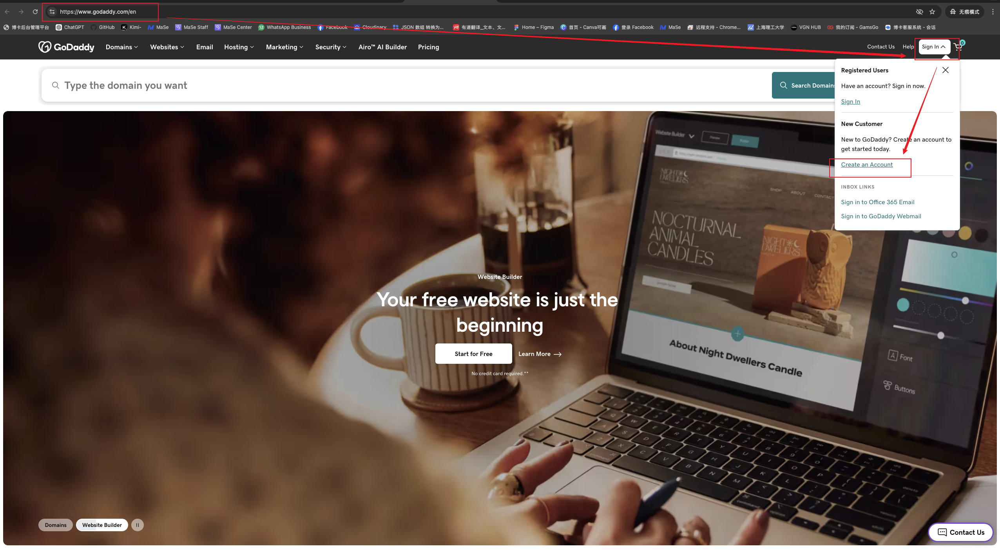
    
图 1：创建godaddy用户

<!-- ====================== 步骤 2 ====================== -->
### 2. 购买域名和SSL证书

  
1. 添加域名到购物车

  

    登录 Godaddy 后，搜索需要使用的域名并添加到购物车。可根据需求选择不同后缀，例如 <strong>.com</strong>、<strong>.ca</strong>、<strong>.net</strong> 等。
  

  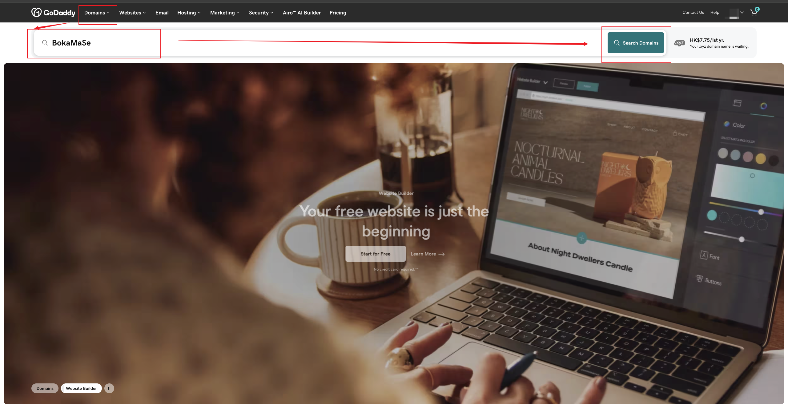
  
图 2：搜索域名

  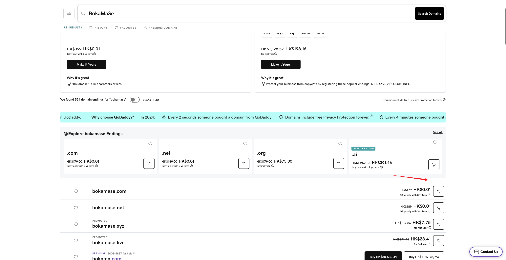
  
图 3：域名添加购物车

  
2. 添加证书到购物车

  

    点击左上角<strong>Godaddy</strong>标识回到Godaddy首页，点击<strong>Security</strong>再选择<strong>SSL Certificates</strong>进入证书类型选择页面。
  

  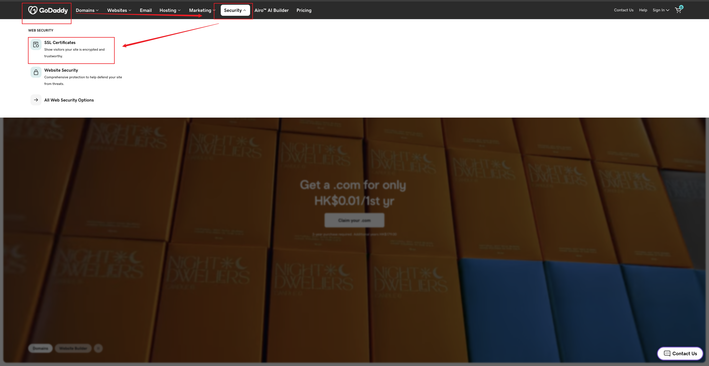
  
图 4：搜索证书

  

    在<strong>SSL Certificates</strong>页面，选择<strong>“Single Domain DV SSL”</strong>再点击<strong>Add to Cart</strong>把证书添加进购物车。
  

  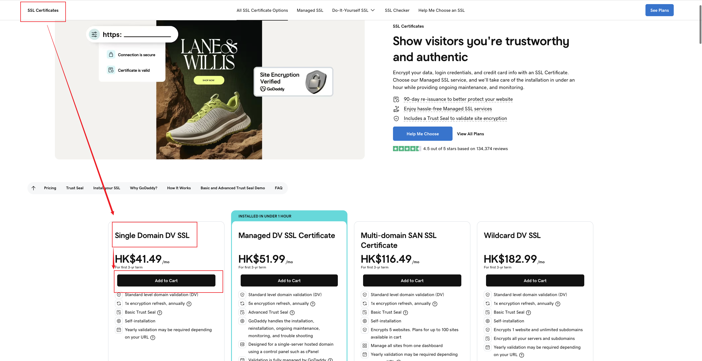
  
图 5：证书添加购物车

  

    <strong>Select number of domains to protect</strong>默认选择<strong>“Protect 1 Website”</strong>
  

  

    <strong>Select term length</strong>根据自身计划选择对应的时长。
  

  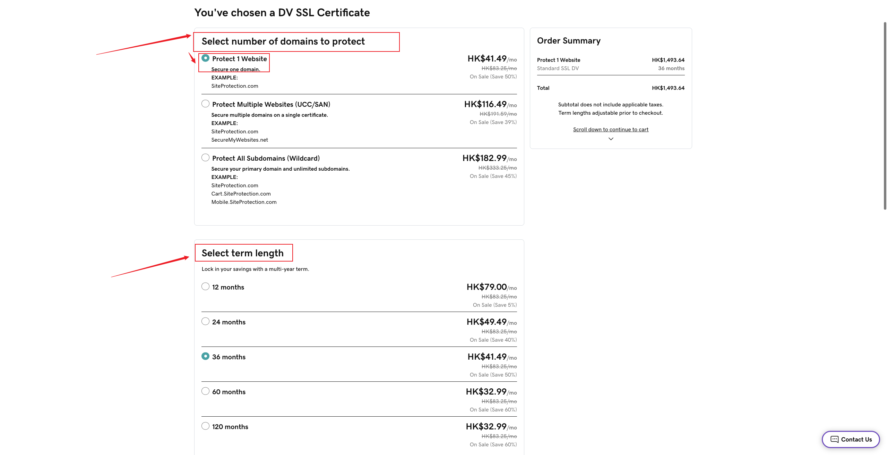
  
图 6：证书选项

  

    <strong>Recommended - We'll install your SSL Certificatet</strong>默认选择<strong>“No thanks, I'll install and configure the SSL myself.”</strong>，然后点击<strong>Continue</strong>。
  

  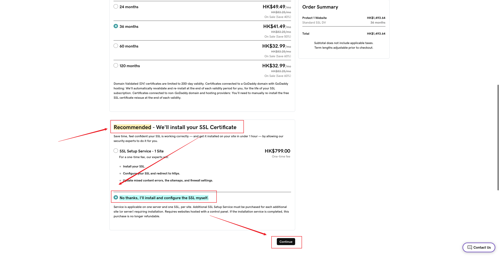
  
图 7：添加购物车项

  
3. 支付和购买

  

    后续直接在购物车中绑定信用卡进行结账付款即可以购买成功。
  

<!-- ====================== 步骤 3 ====================== -->
### 3. 域名配置解析

  
3. 域名配置解析

  

    首页点击右上角 <strong>账户名称</strong> 点击 <strong>My Products</strong> 进入控制台页面。
  

  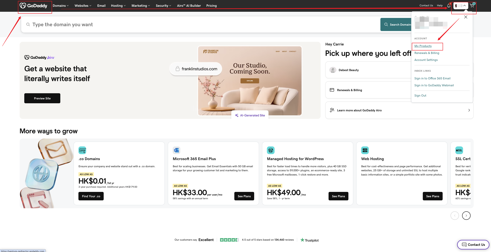
  
图 7：进入控制台

  

    在控制台页面点击右上角 <strong>账户名称</strong> 点击 <strong>My Products</strong> 进入我的产品页面。
  

  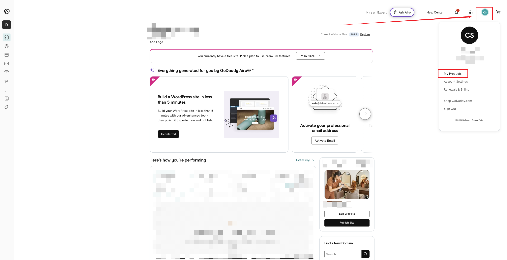
  
图 8：进入我的产品

  

    在我的产品页面点击 <strong>Domains</strong> 下的 <strong>DNS</strong> 按钮进入 <strong>DNS Management</strong> 页面。
  

  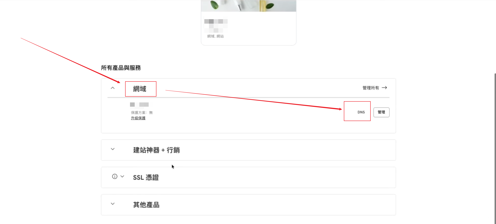
  
图 9：进入DNS管理

  

    在 <strong>DNS 管理</strong>页面，选择<strong>DNS 记录</strong>找到<strong>CNAME类型，WWW名称</strong>的记录点击后面的编辑按钮。如果没有此条内容，需要新增一条<strong>CNAME类型，WWW名称</strong>的记录继续下一步操作。
  

  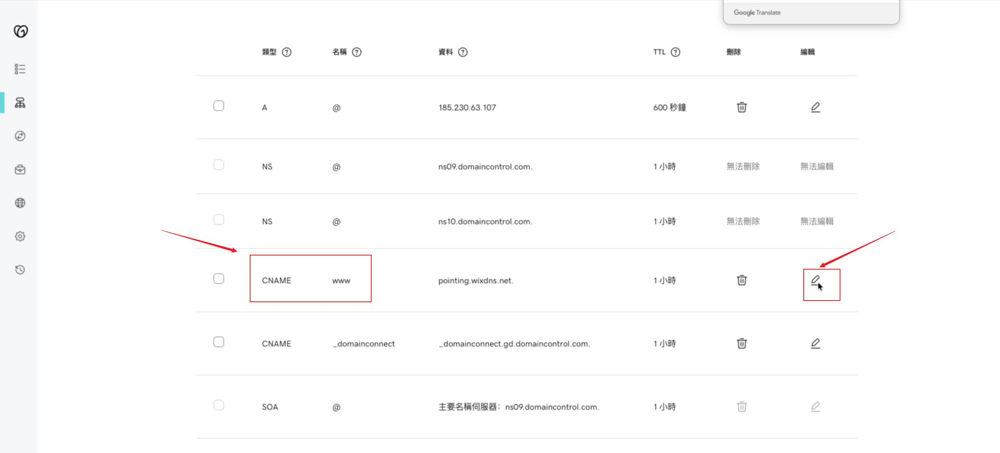
  
图 10：修改DNS

  

    在<strong>内容值</strong>内填入 <strong>alb-tfjjjymtxlxmzkk0lh.us-west-1.alb.aliyuncsslbintl.com</strong> ，<strong>TTL</strong>栏位选择自定义输入600，然后保存。
  

   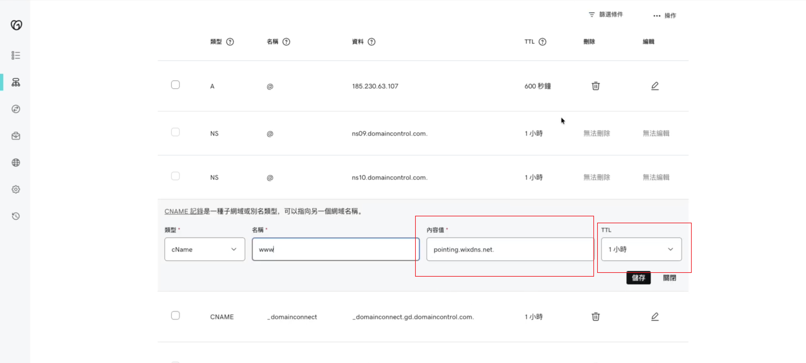
  
图 11：修改内容值和TTL

  

  之后设置转址，在 <strong>DNS Management</strong> 页面点击 <strong>Forwarding</strong> 点击 <strong>Add Forwarding</strong> 按钮
  

   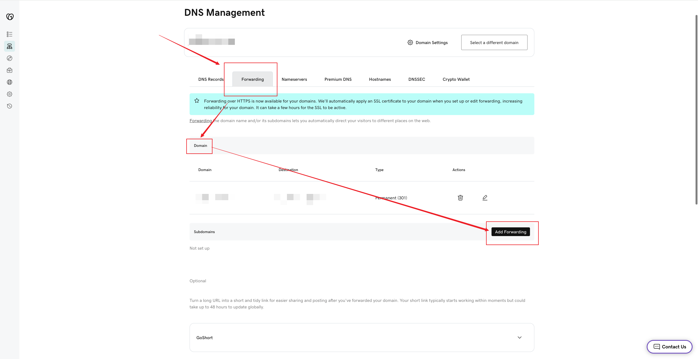
  
图 12：添加转址

  

  之后设置转址，在 <strong>DNS Management</strong> 页面点击 <strong>Forwarding</strong> 点击 <strong>Add Forwarding</strong> 按钮
  

   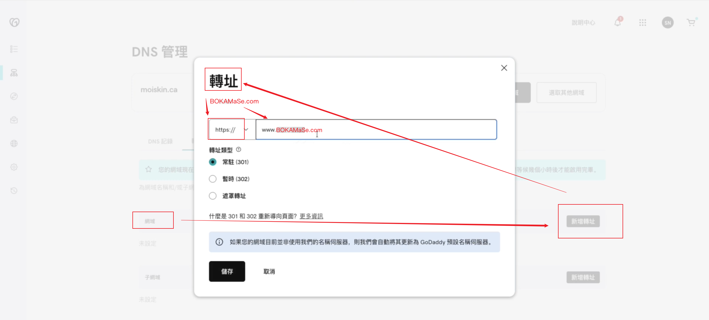
  
图 13：修改内容值和TTL

  

    保存后，系统会开始同步 DNS 配置。
  

<!-- ====================== 步骤 4 ====================== -->

  
4. 导入 DNS 记录

  

    如果已有现成的 DNS 配置，可使用批量导入方式快速完成设置。
  

  

    支持将 JSON 或 Excel 格式的数据转换为 Godaddy 可识别的 DNS 记录内容后导入。
  

  

    导入完成后，请再次确认记录内容是否正确，避免影响网站访问。
  

<!-- ====================== 步骤 6 ====================== -->

  
5. 配置 SSL 证书

  

    在 SSL 设置页面中，点击 <strong>安装证书</strong> 或 <strong>上传证书</strong>。
  

  

    上传系统提供的证书文件及私钥文件，完成 SSL 配置。
  

  

    保存后，系统会自动启用 HTTPS 加密访问。
  

<!-- ====================== 步骤 7 ====================== -->

  
6. 检查域名状态

  

    返回 Godaddy 域名列表页面，可查看当前域名是否已经成功启用 DNS 解析及 SSL 状态。
  

  

    当域名状态显示正常且浏览器可通过 HTTPS 打开时，说明配置已经完成。
  

---

<!-- ====================== 温馨提示 ====================== -->
## 温馨提示

  <strong>注意 1：</strong> DNS 配置修改后不会立即生效，通常需要等待几分钟到 24 小时不等。

  <strong>注意 2：</strong> 如果域名同时存在多个 A 记录或 CNAME 记录，可能会导致访问异常，请确认记录内容是否重复。

  <strong>注意 3：</strong> SSL 证书上传后，如果浏览器仍提示不安全，可尝试等待证书同步完成后再访问。

  <strong>注意 4：</strong> 修改 DNS 前建议先备份现有记录，避免误删后导致网站无法访问。

  <strong>注意 5：</strong> 如果网站已绑定其他 CDN、Cloudflare 或第三方 DNS 服务，请先确认当前域名的 NS 指向是否正确。

---

<!-- ====================== 关联教程 ====================== -->
## 关联教程

  

    ↗
    <a className="doc-related-text" href="./cloudflare-domain-config">
      <strong>Cloudflare 域名配置</strong>
      通过 Cloudflare 管理 DNS 与 HTTPS 访问
    </a>
  

  

    ↗
    <a className="doc-related-text" href="./website-domain-binding">
      <strong>网站域名绑定</strong>
      将自定义域名绑定到网站并完成访问设置
    </a>
  

